# Task 10.1
## Ansible

Checking ping:

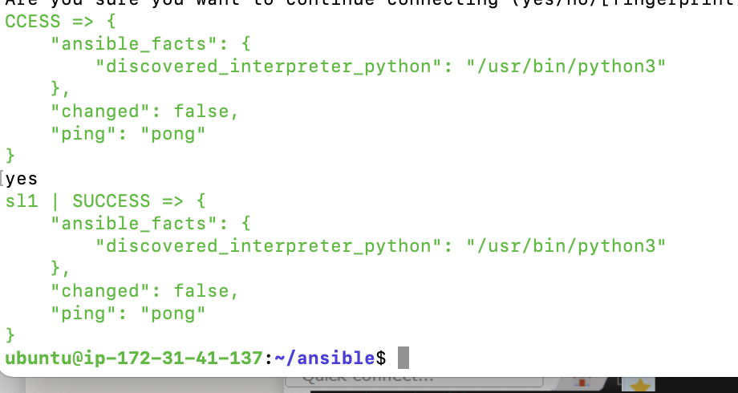

Hosts configuration:

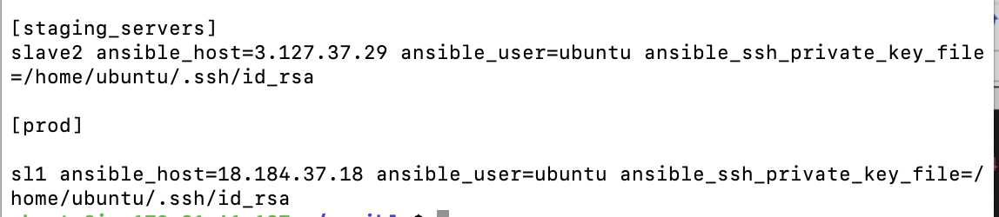

Inventory:

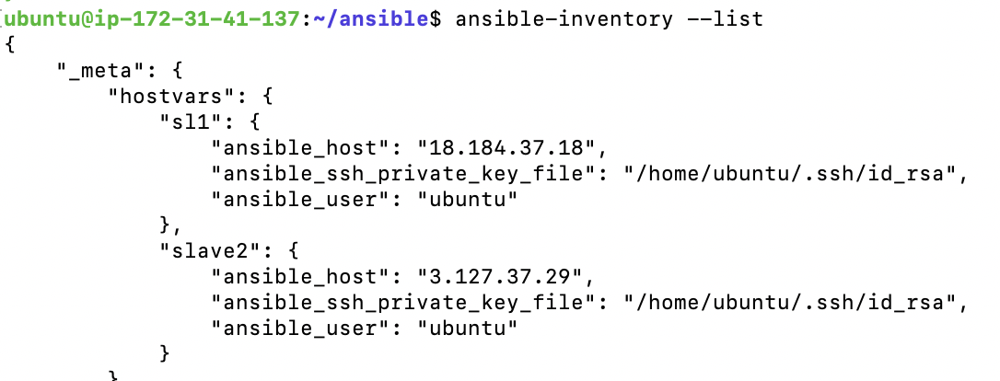

Tree:
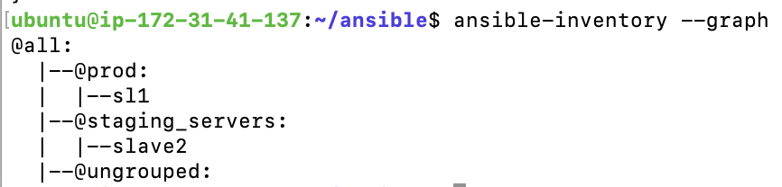

Shell info:
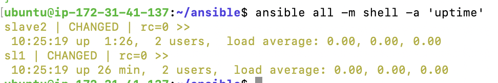

Checking file integration:
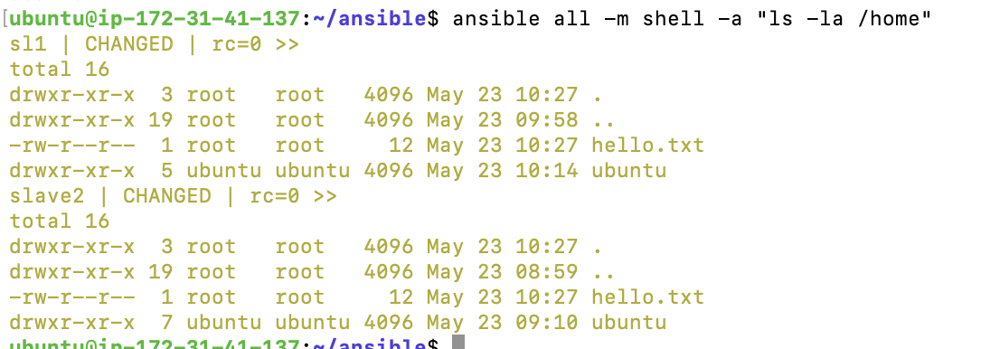

Remove:
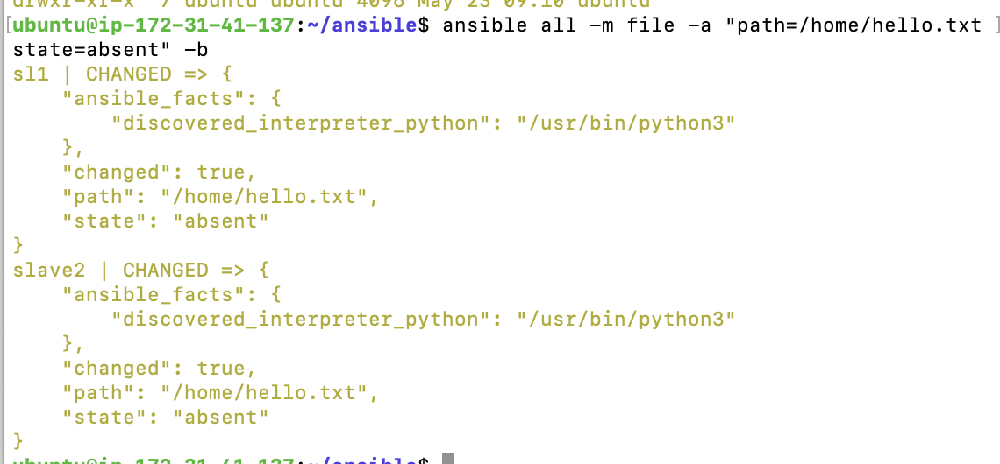

Install apache2 via playbook:
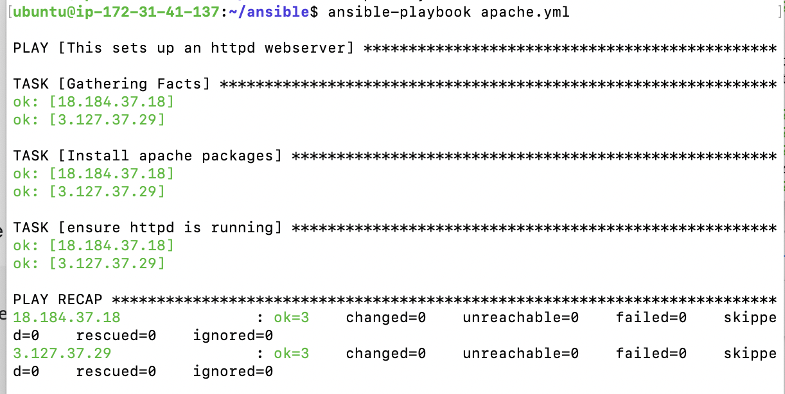

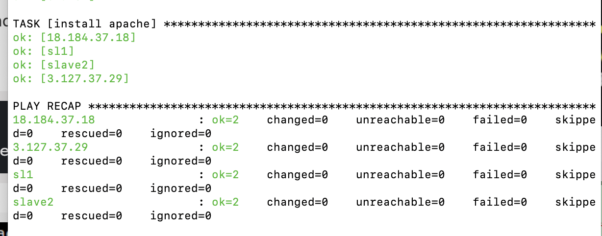

Result on slaves:
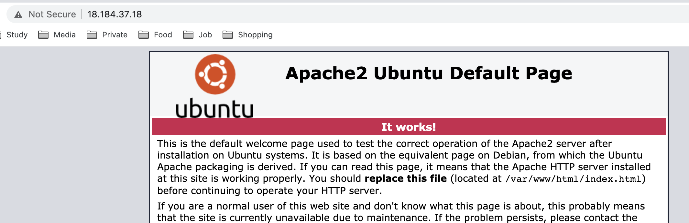

Started apache2 services via playbook:
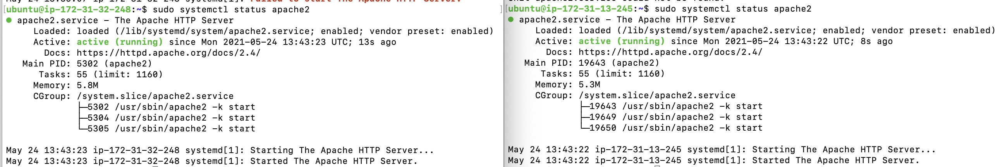

Result:
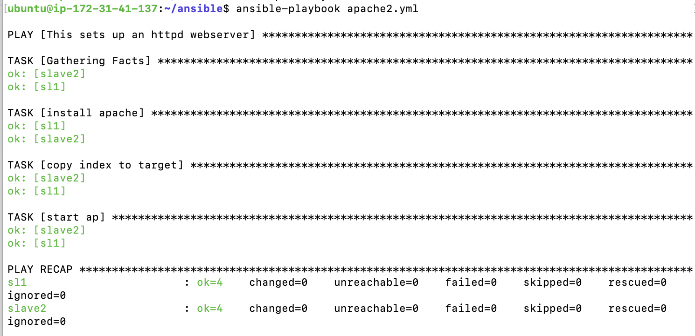

Result:
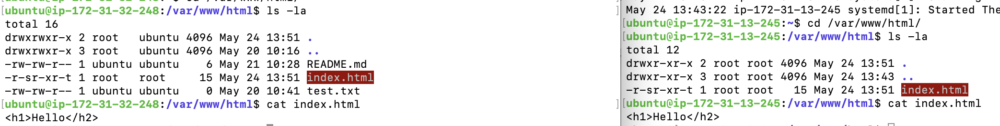

Ansible output:
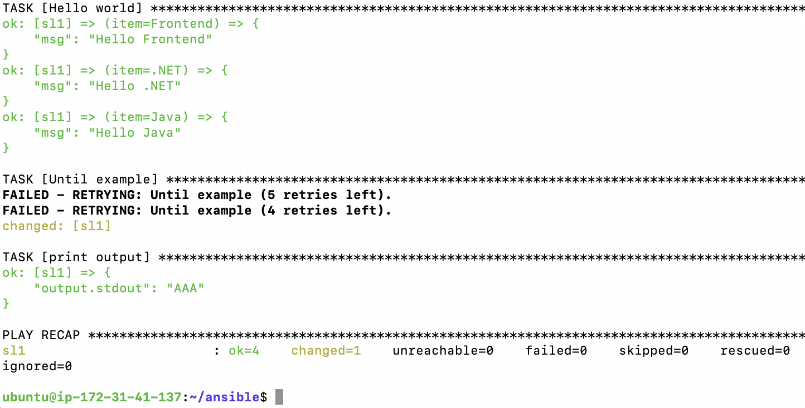

Playbook:
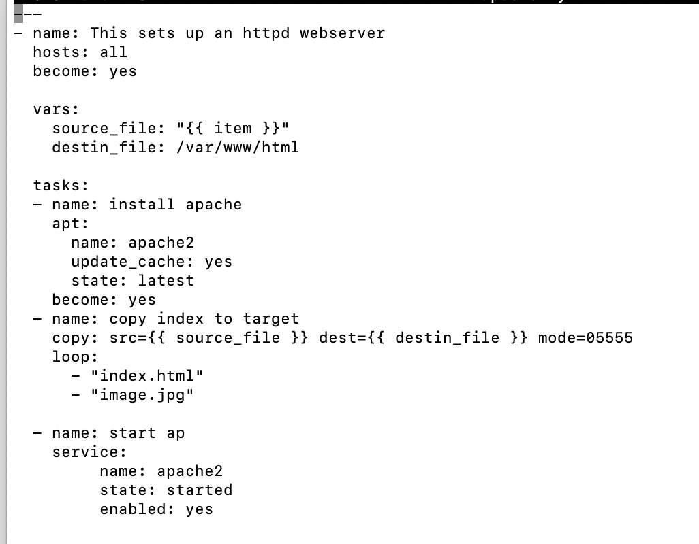

Result via apache:
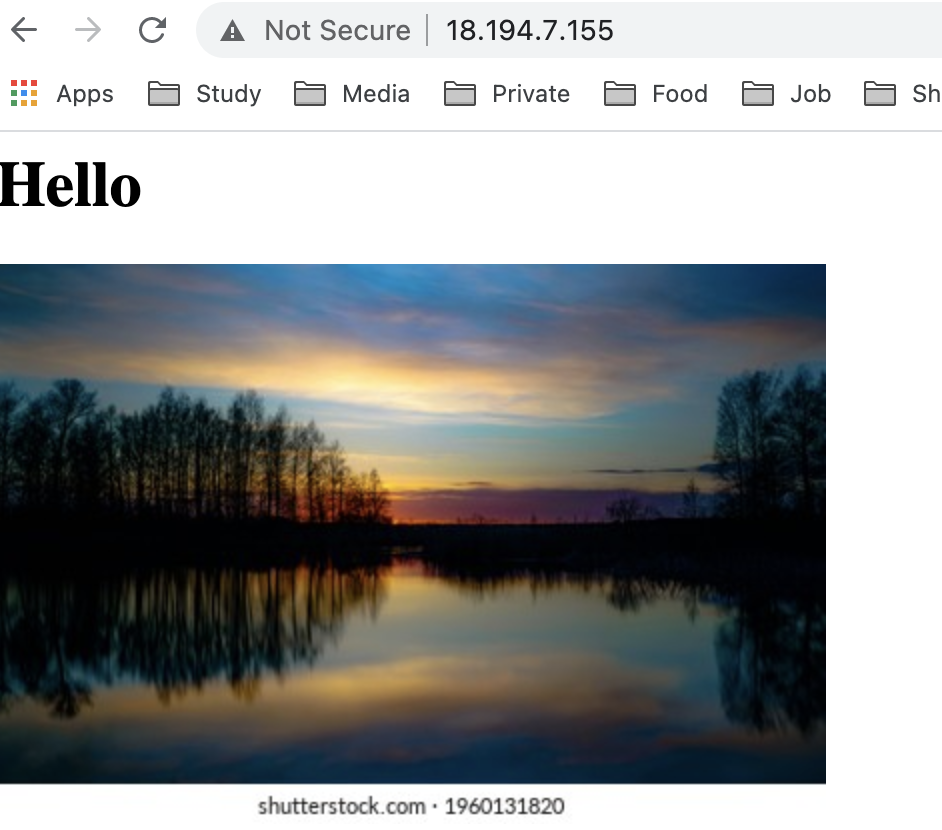

Roles creating:
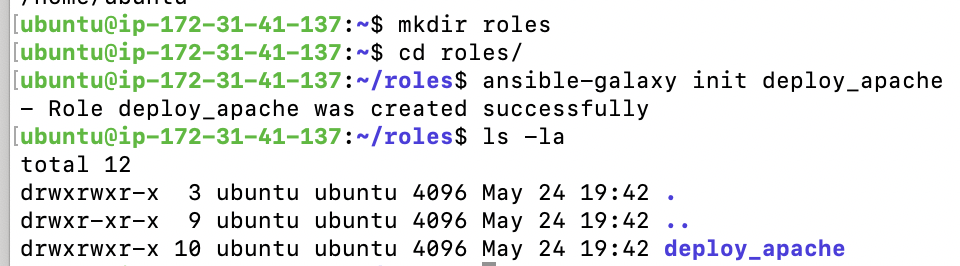

Structure:
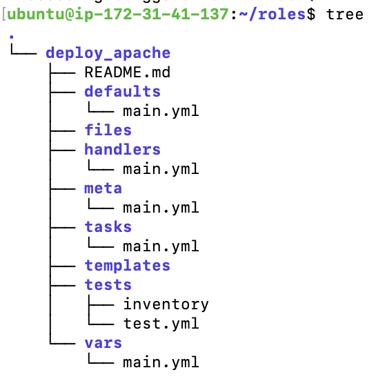

res:
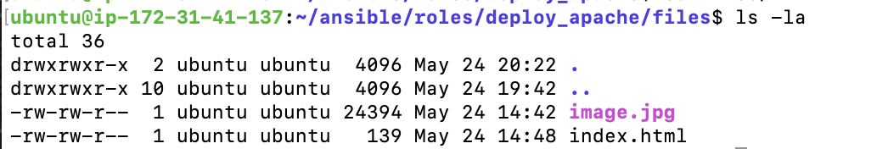

Part creation:
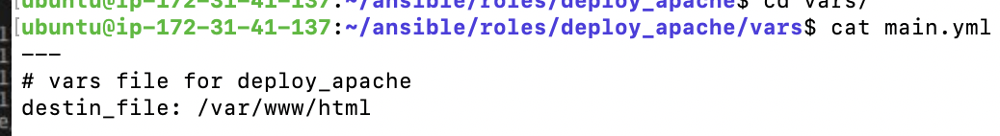

Task creation:
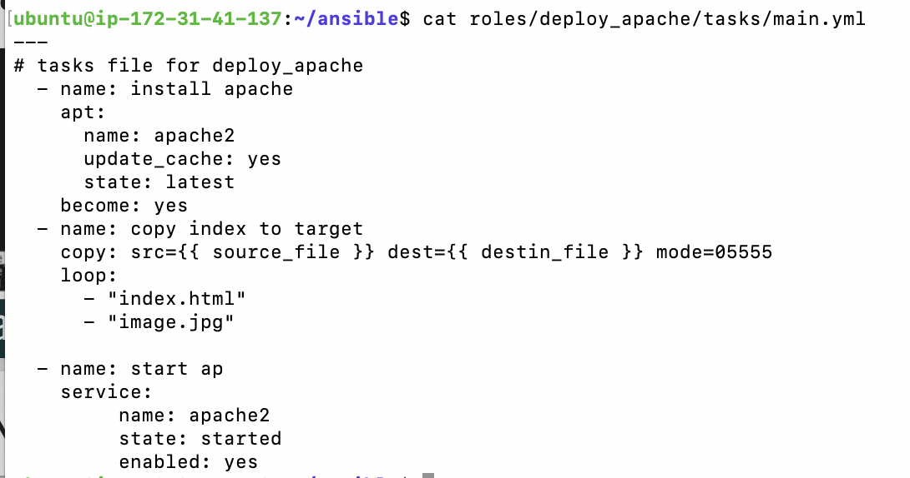

Playbook success:
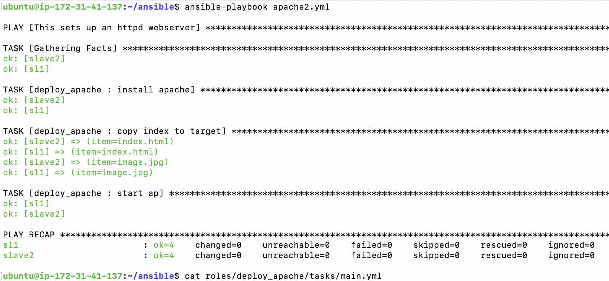

Result:

