# Task 2.1
**PART 1. HYPERVISORS**

**1. Most popular hypervisors for infrastructure virtualization are:**

*  **Hyper-V** runs each virtual machine in its own isolated space, which means you can run more than one virtual machine on the same hardware at the same time
*  **VMware vSphere** A vast majority of modern businesses rely on virtualization to help them scale more efficiently and cut hardware costs. And today, VMware vSphere is the most advanced and prominent server virtualization product on the market.
*  **Virtual Box** open-source software for virtualizing the x86 computing architecture. It acts as a hypervisor, creating a VM (virtual machine) where the user can run another OS (operating system).

**2. Differences of the most popular hypervisors are:**
  1. **Hyper V** Hyper V is capable of creating virtual machines on x86-64 systems running Windows. Moreover, it is possible to configure a server computer running Hyper V to expose individual virtual machines to one or multiple networks.
  2. **VMware**
  VMware is an organization that provides cloud computing and platform virtualization software and services. VMware products divide into two levels: desktop and server applications. Moreover, VMware desktop software executes on major operating systems such as Windows, Linux, and Mac OS.
  3. **VB**
  Client Hyper-V is all-inclusive, Oracle offers an extension pack for VirtualBox. This extension pack adds support for USB devices, disk encryption, NVMe, RDP, and PXE boot (for Intel network cards). This extension pack is a non-open source product that is provided under a Personal Use and Evaluation License

**PART 2 WORK WITH VIRTUALBOX**

**1.1-1.3 tasks**

My vms:

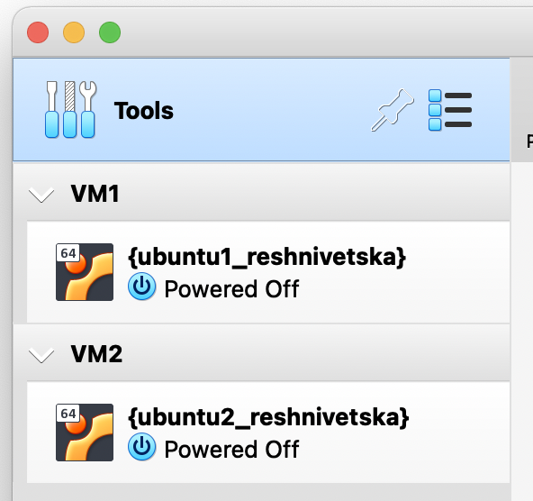

ISO setup:

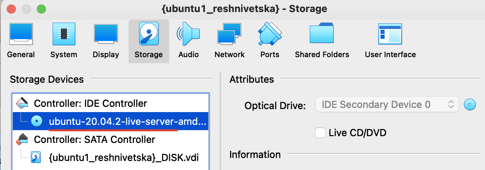

**1.4** Have used vbox commands for creaion and managing:

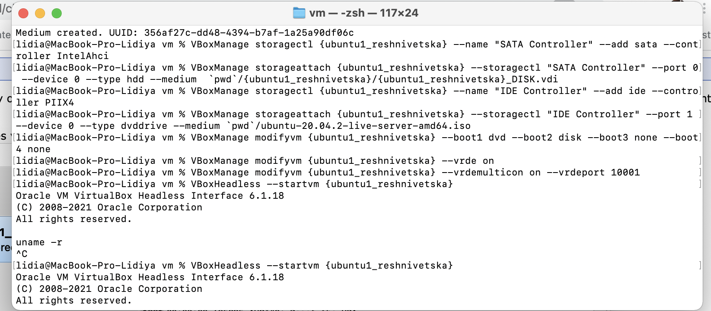

 And managing

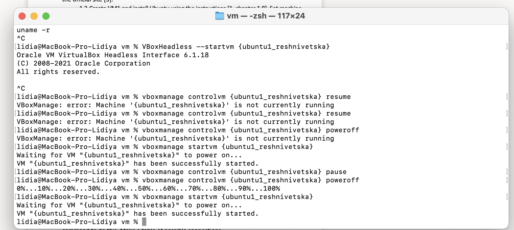

**1.5-1.6** pls check screen on point **1-1.3**:

**1.7** Snapshots

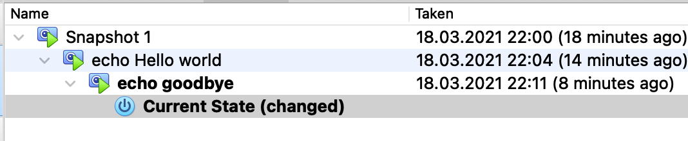

**1.8** Export and import

Export:

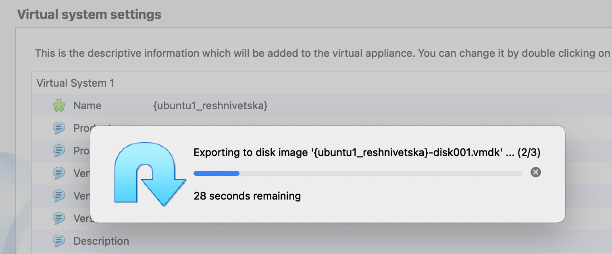

Import:

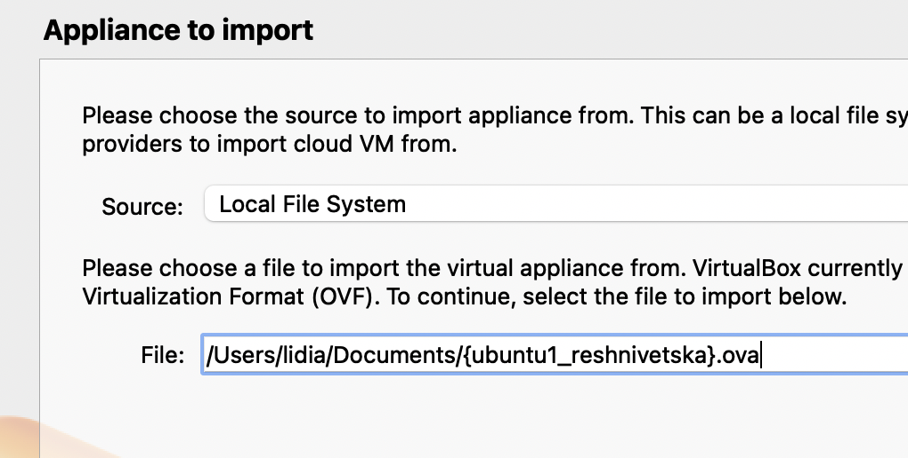

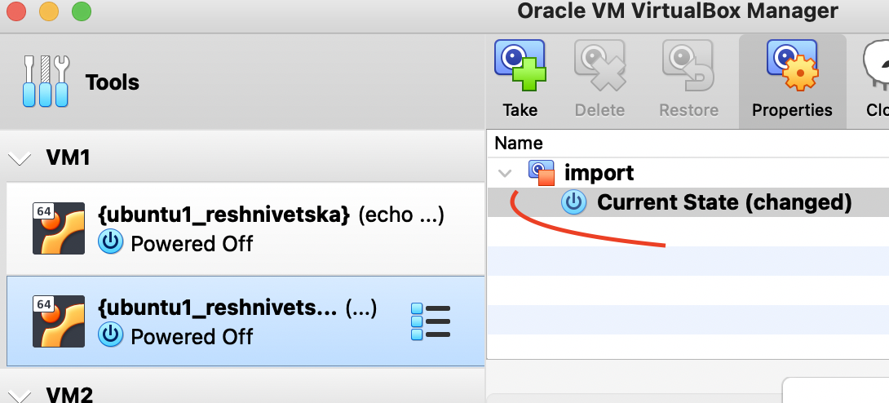

**PART 2 Configuration of virtual machines**

**2.2** USB connection:

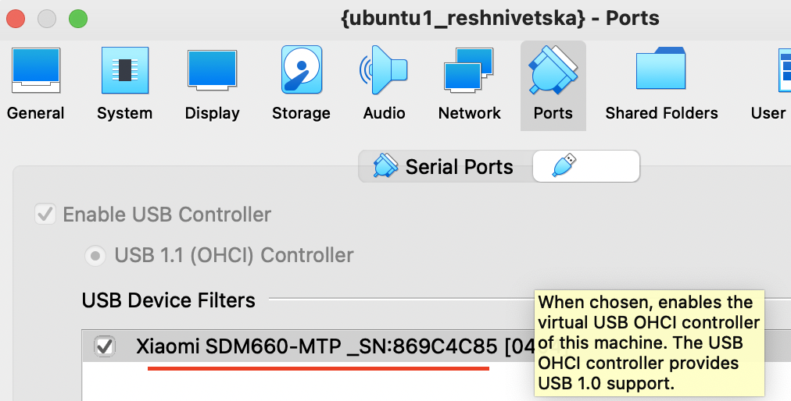

via ubuntu:

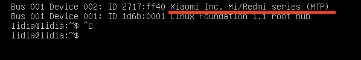

**2.3** Shared folder:

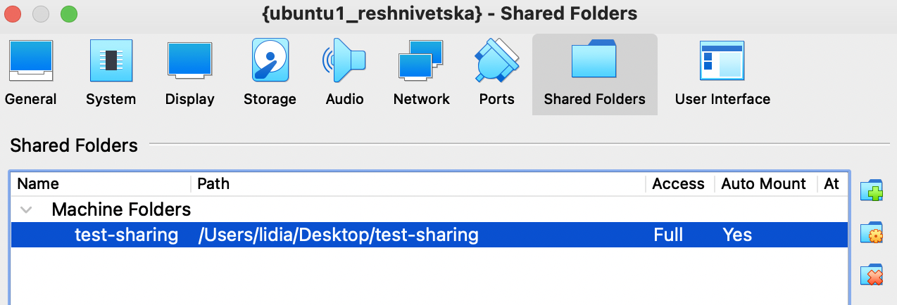

Evidence:

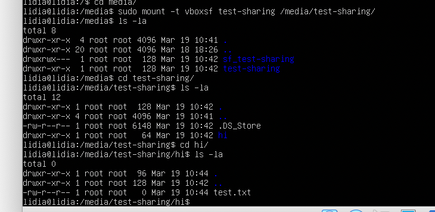

**2.4** Configure  different  network  modes  for  VM1,  VM2.

## **Internal network:**

From host to vm:
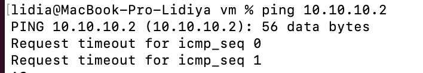

From vm to vm:
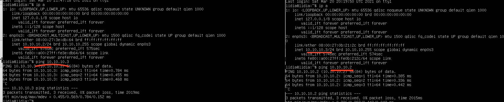

From vm to host:

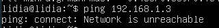

### **Other network connections you can check via this path:**
### [Screens](https://github.com/lidia3/DevOps_online_Zhytomyr_2021Q2/tree/main/m2/task2.1/images)

**3.Work with CLI through VBoxManage.**

Screens with commands were displayed in topic **1.4**

**PART 3. WORK WITH VAGRANT**

Installed vagrant:

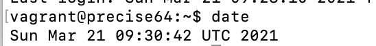

Connection via ssh to vagrant box:

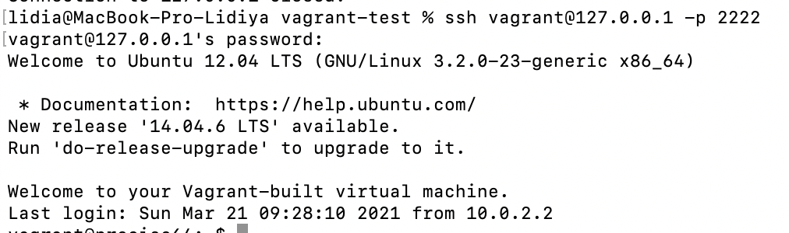

My ubuntu box with newer version:

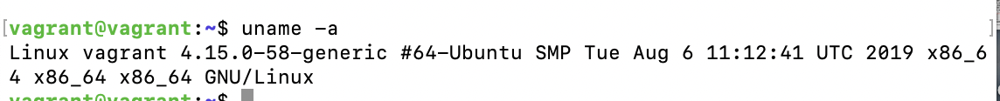

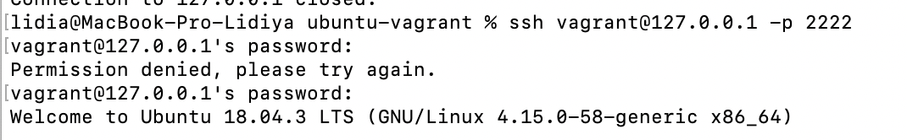
