## Module 2 Virtualization and Cloud Basic
## TASK 2.2

## My link for S3:
http://lidiareshnivetska.pp.ua.s3-website.eu-central-1.amazonaws.com

Task 1-2:

Task 3: Will be described in further steps

Task 4: Linux Virtual Machinewith Amazon Lightsail

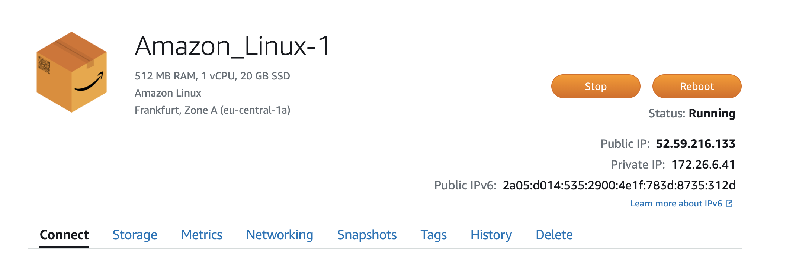

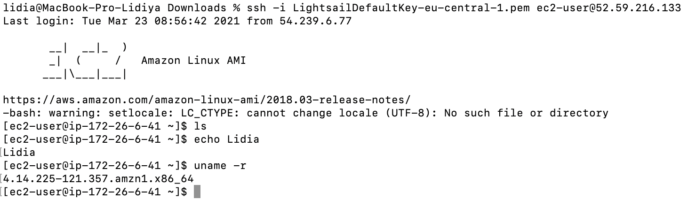

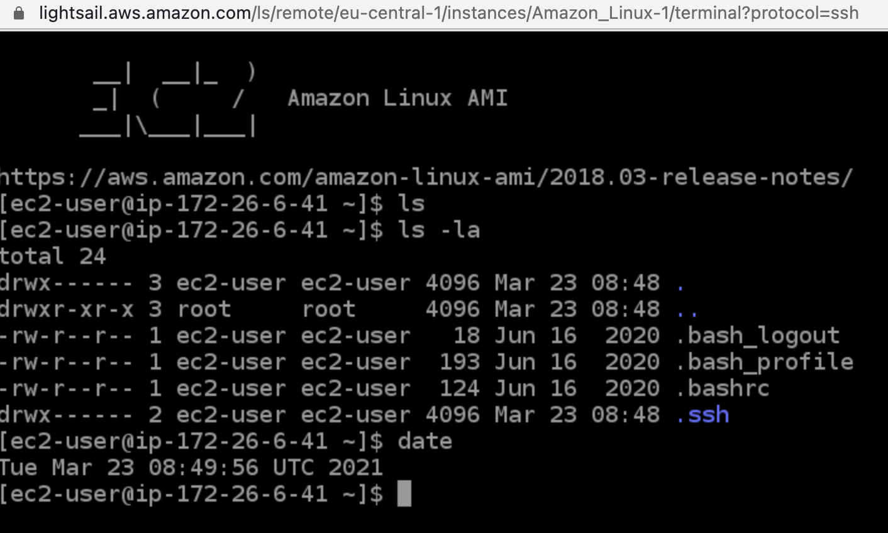

Task 5.Launch another Linux Virtual Machine without Amazon Lightsail.

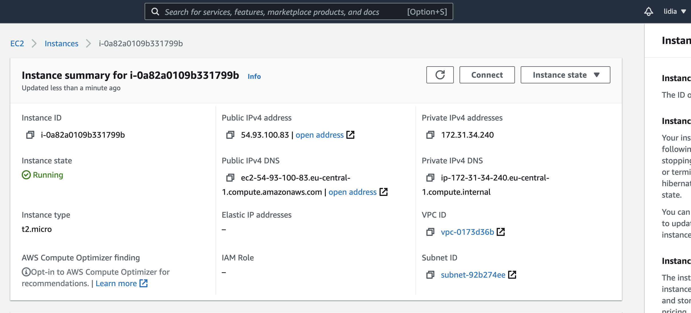

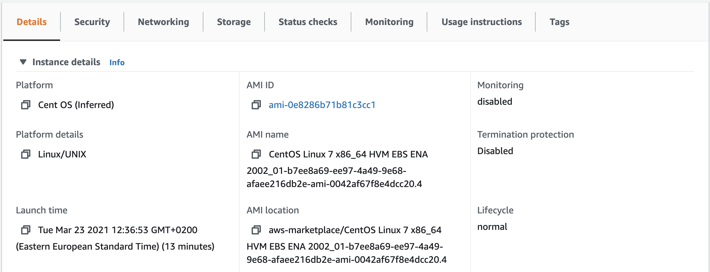

Connecting via ssh:

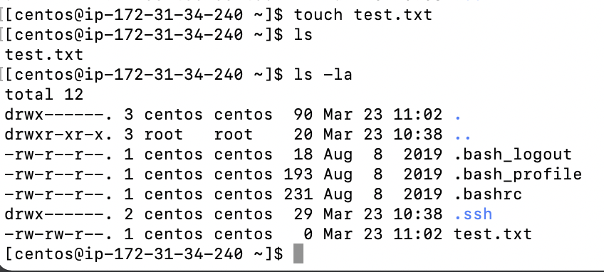

Task 6-8:

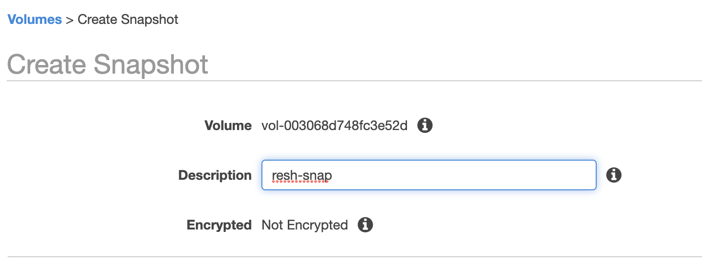

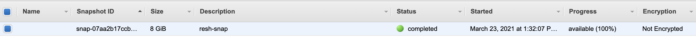

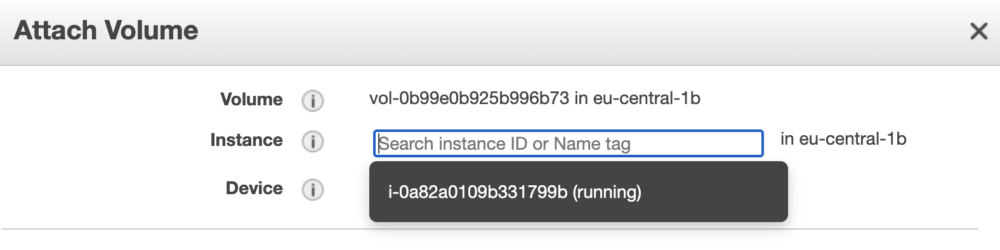

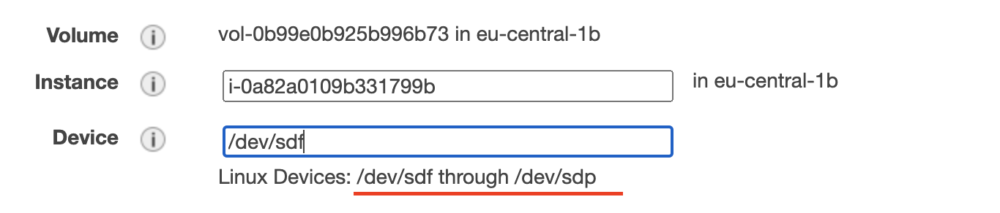

Mounting more storage space:

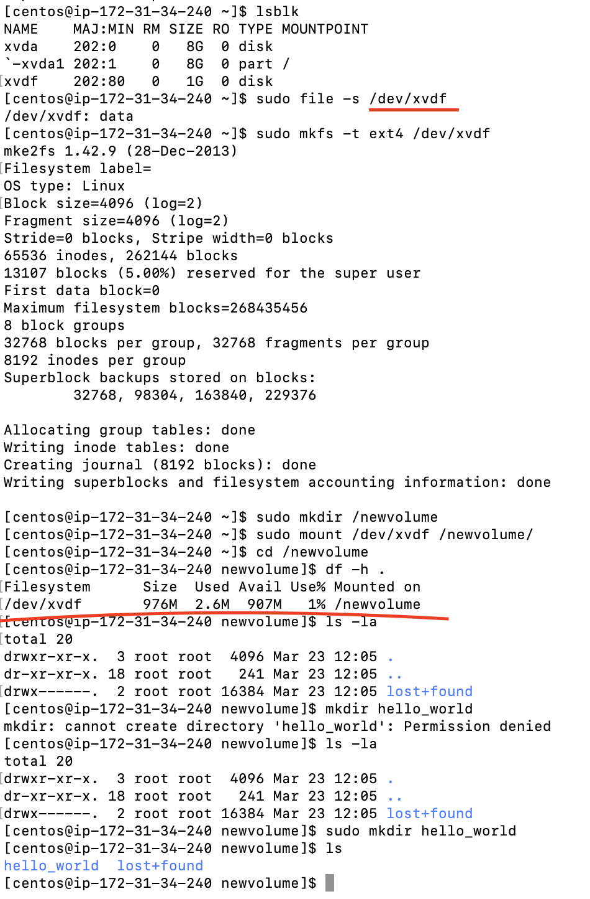

Task 8-9: Launch the third instance from backup.

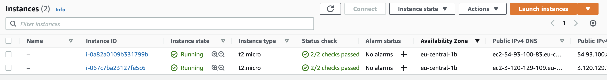

Mounting storage space from first instance:

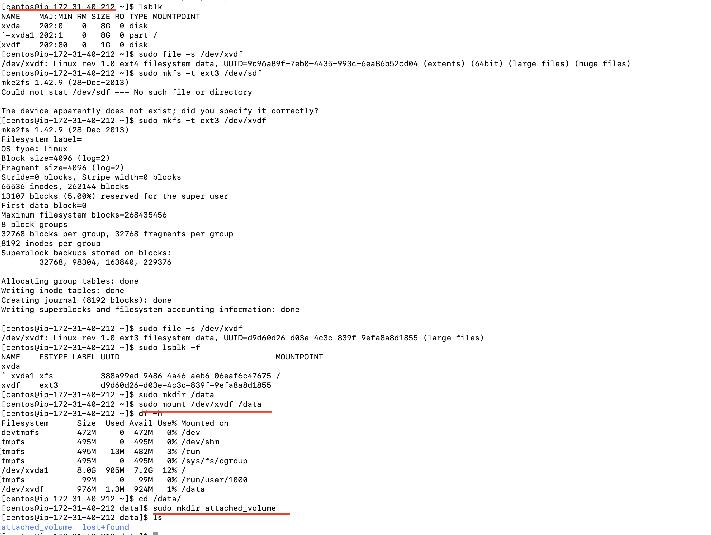

Task 10. Launch and configure a WordPress instance with Amazon Lightsail

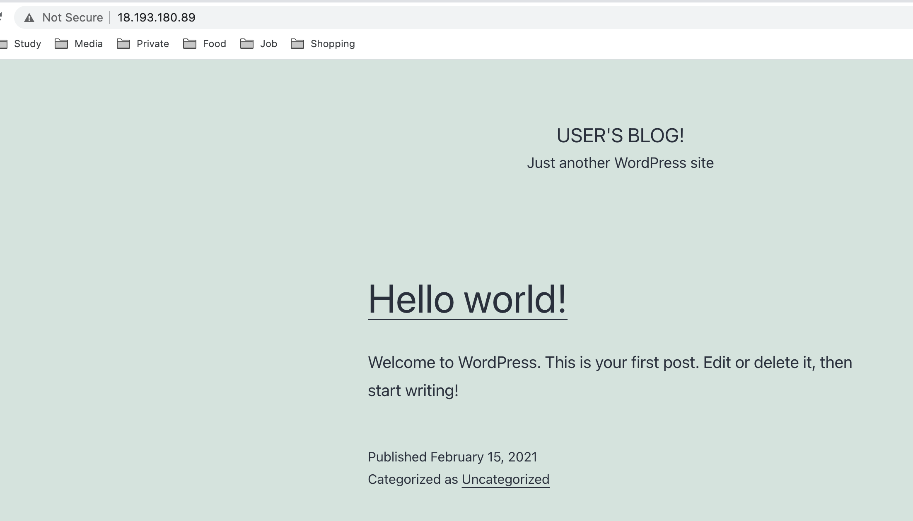

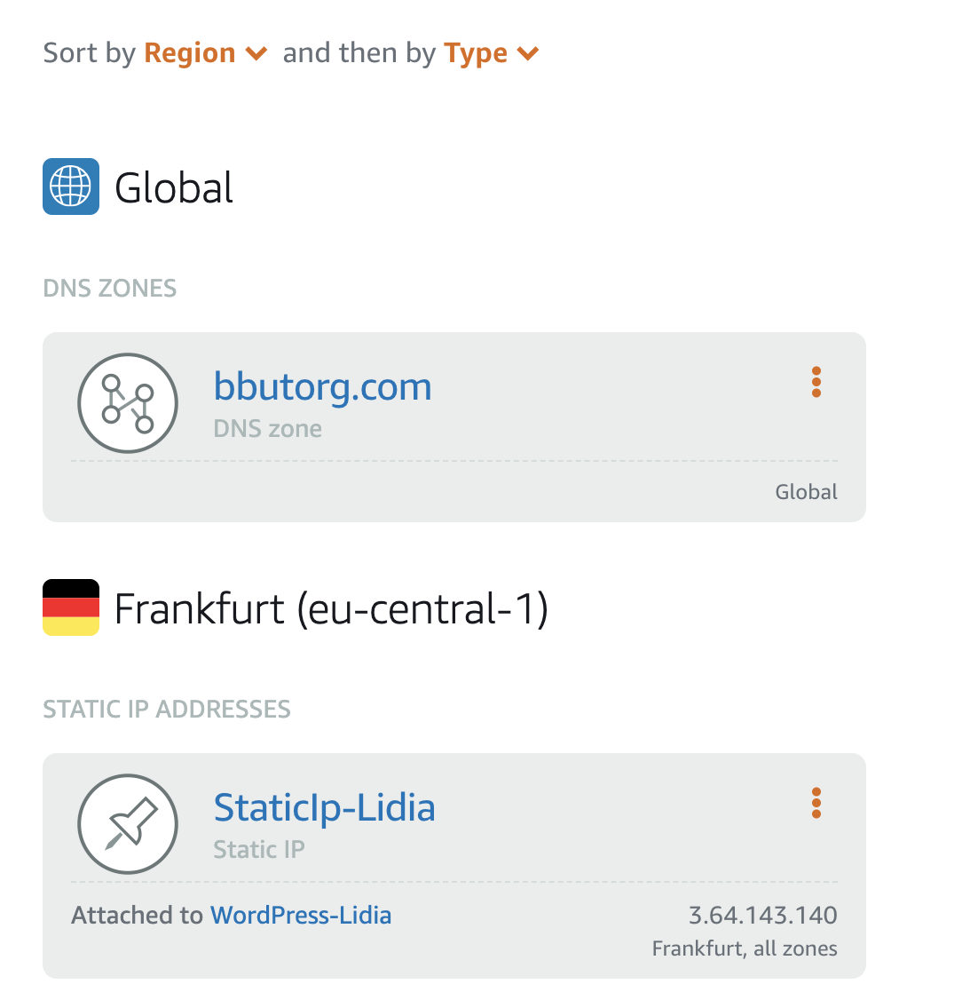

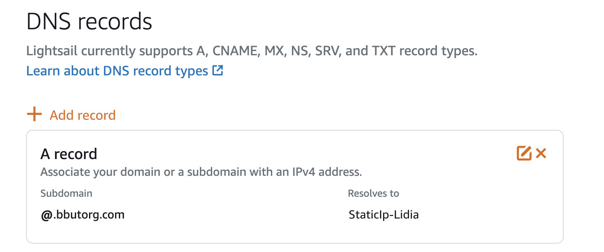

Task 11. S3:

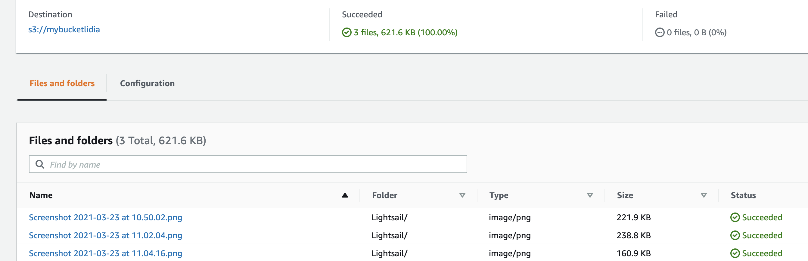

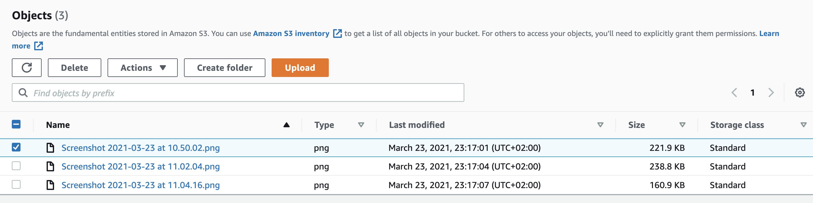

Task 12. Amazon S3 using the AWS CLI.Create a user AWS IAM, configure CLI AWS and upload any files to S3.

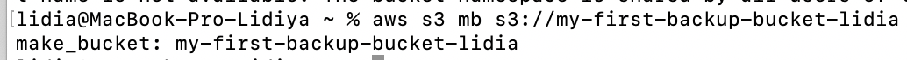

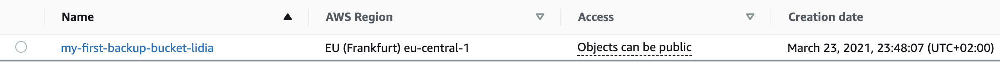

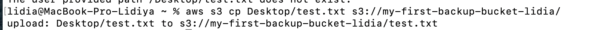

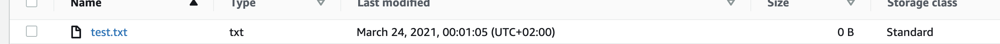

Task 13.Explore the possibilities of creating your own domain and domain name for your site.

Tried here elastic ip for WP:

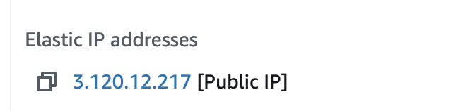

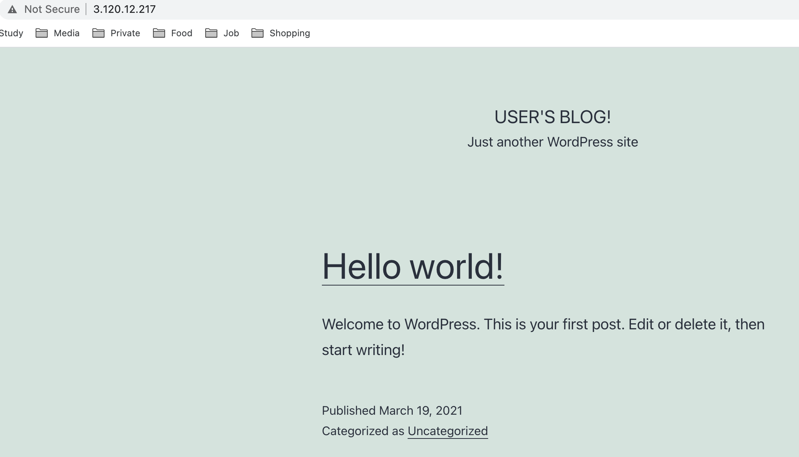

Task 14.Review   the   10-minute example Deploy   Docker   Containers   on   Amazon   Elastic Container Service (Amazon ECS). Repeat, create a cluster, and run the online demo application or better other application with custom settings.

Created ec2:

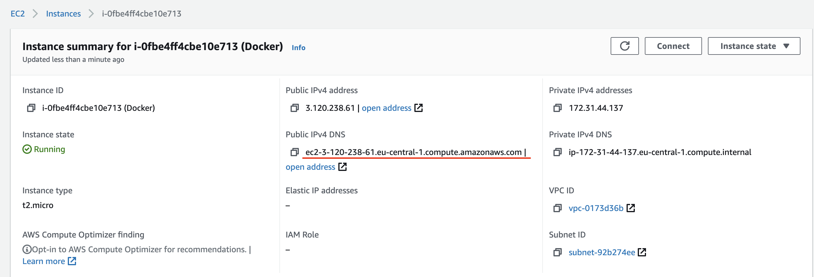

Started needed services for docker:

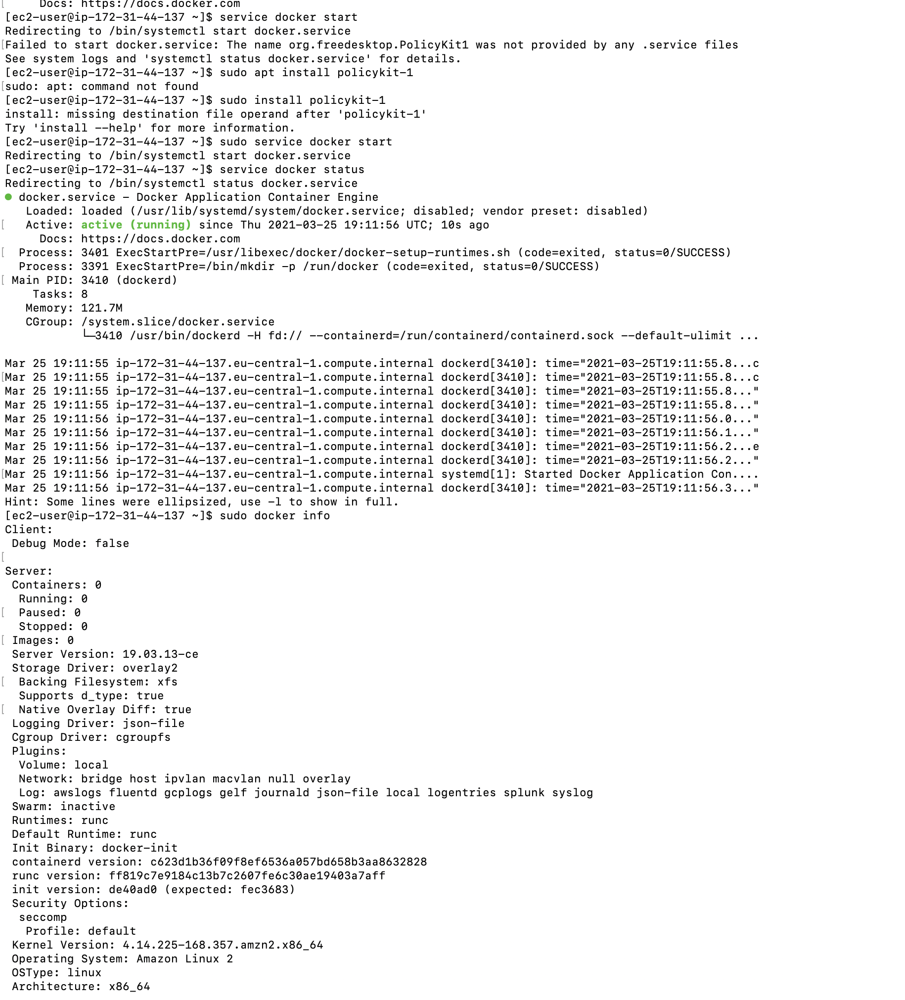

Run docker:

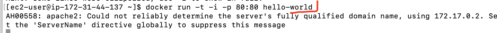

Inbound rules:

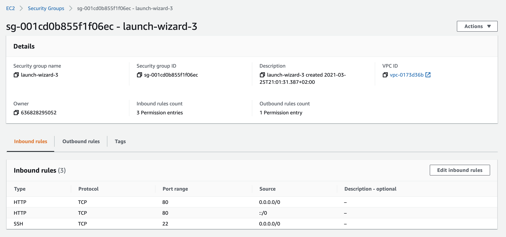

Task 15. Create a static website on Amazon S3

## My link:
http://lidiareshnivetska.pp.ua.s3-website.eu-central-1.amazonaws.com
