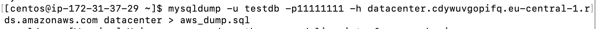

## Module 3 Database Administration
## TASK 3.1

Task 1-3:

Draft of my Database:

/ 1-st table: consumer ->
2-d table: datacenter ->
3-d table: availaibility-zone /

Task 4: Created db

Task 5-6:
Select, where, group by, order by:

Task 7.Execute other different SQL queries DDL, DML, DCL.

## DDl:

select:

alter:

drop:    

comment and rename:

## DML:

insert:

update:   

delete:  

Result of merging between two tables:

call:    

explain:  

update:

## DСL:

grant:

revoke:  

## Part 2

Task 10-12: backup of db and dropping one ttable

For backup I used cmd: mysqldump -uroot -h 127.0.0.1 -p datacenter > backup.sql

Next screen displays restored database from file backup.SQL

As we see here all tables

Task 13-15 connect via rds:

Preparation rds:

I copied from host to aws instance backup.sgl, then via instance I connected our db from aws:

select check:

Task 16: make mysqldump

## Part 3

Task 17-19: DynamoDb

table:

scan:

query:

