## Module 4 Networking Fundamentals
## TASK 4.1

## Task 1-7:

My topology:
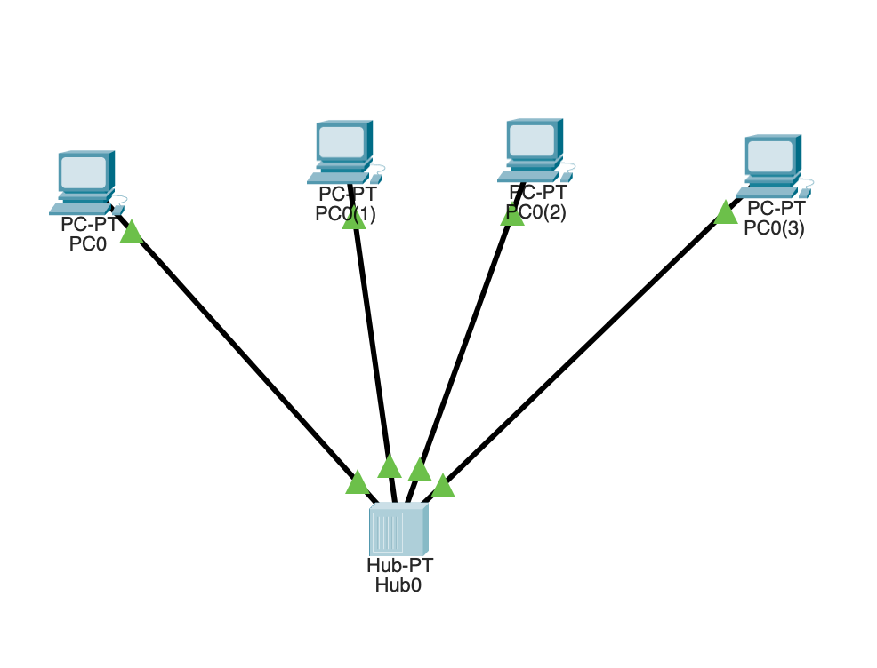

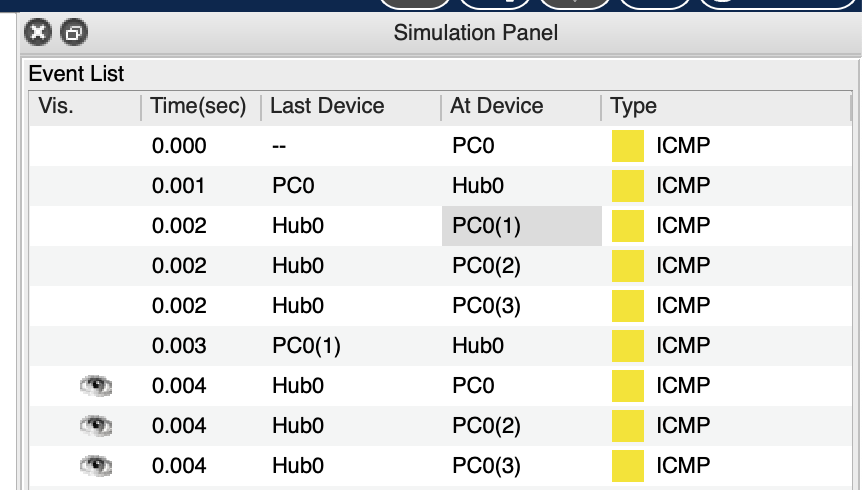

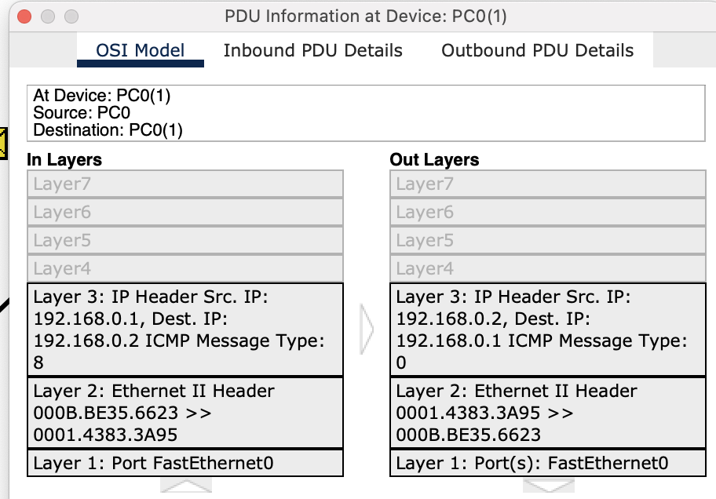

Connection works:

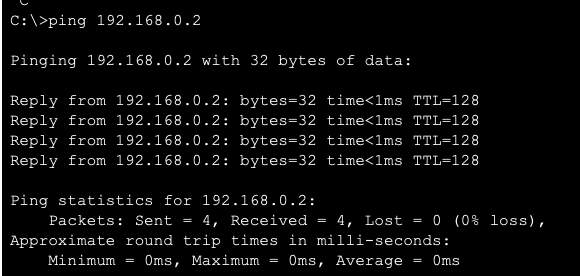

## Task 8:
Computers don`t see each other without ip configuration

## Task 9:

Two hubs topology:

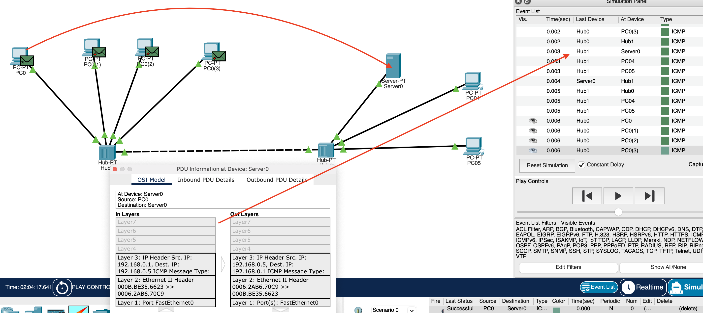

## Task 12:

Switch topology:

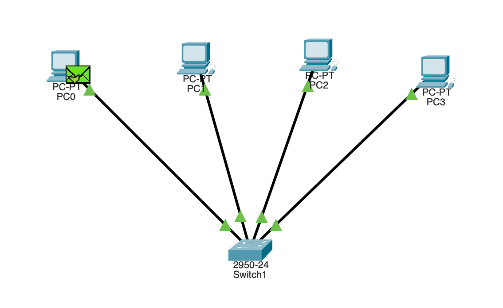

## Task 13:

Difference between switch and hub topology:
1. Hub is operated on Physical layer.
2. Switch is operated on Data link layer.
3. In hub, Packet filtering is not provided.
4. In switch, Packet filtering is provided.
5. Hub is simply old type of device and is not generally used.

## Task 14-17:

Two switches topology:

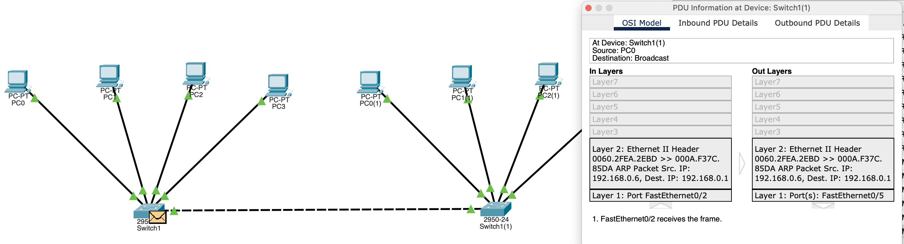

## Task 18-22:
Two subnets:

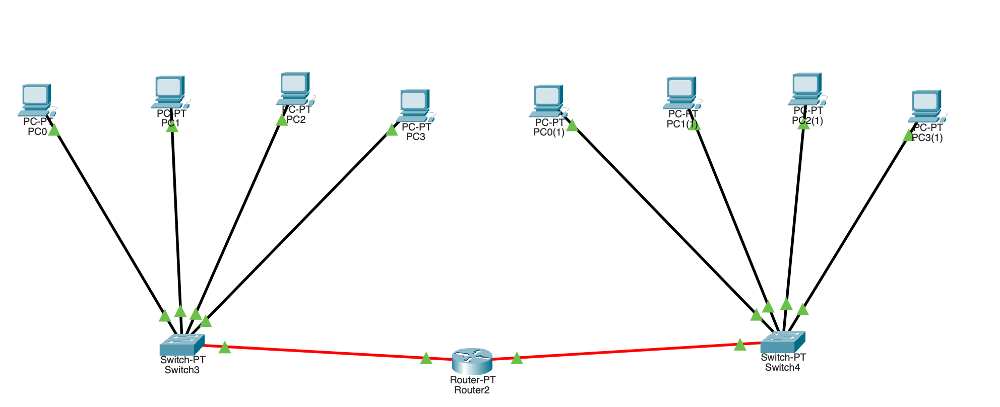

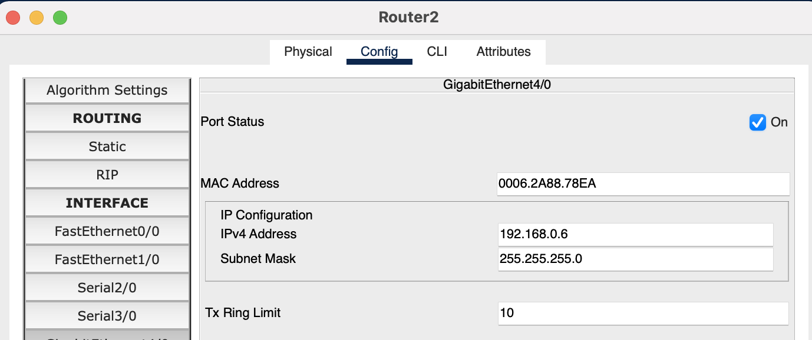

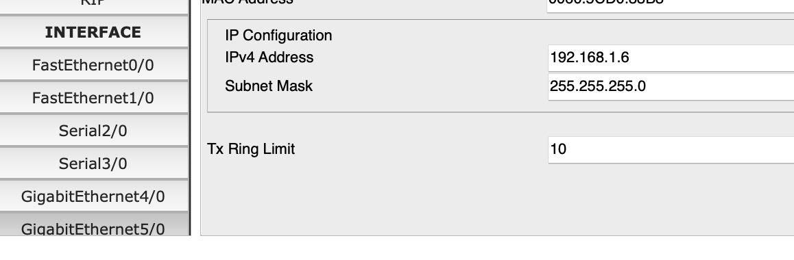

Ping host from subnet 192.168.0.1:

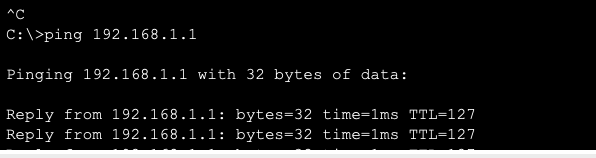

## Task 23:

Router is compatible with NAT but switch is not.
A switch is a networking device, which provides the facility to share the information & resources by connecting different network devices, such as computers, printers, and servers, within a small business network. A router is a networking device used to connect multiple switches and their corresponding networks to build a large network. These switches and their corresponding networks may be in a single location or different locations.
