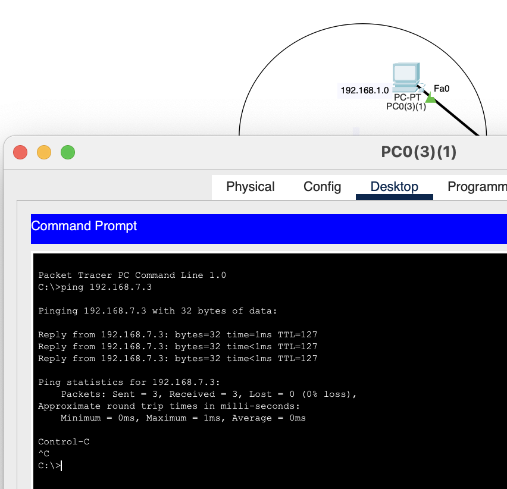

## Module 4 Networking Fundamentals
## TASK 4.2

## Task1 .

Необхідно змоделювати корпоративну мережу організації, яка містить 2  будинки  по  2  поверхи  в  кожному.  Горизонтальна  підсистема  поверху складається з однієї робочої групи по 5 комп'ютерів.Провести аналіз працездатності мережі і її трафіку.

## Task2 .

Необхідно змоделювати корпоративну мережу організації, яка містить 1  будинок  з  чотирма  поверхами.  Горизонтальна  підсистема  поверху складається з двох робочих груп по 3 і 5 комп'ютерів відповідно.Провести логічну структуризацію мережі на 8 підмереж (відповідно до  кількості  робочих  груп).  Провести  аналіз  працездатності  мережі  і  її трафіку.

## Task3 .

Необхідно  змоделювати  локальну  мережу  комплексу  з  5 одноповерхових будівель. Одна будівля -1робочагрупапо 6 комп'ютерів. Мережа будується на основі маршрутизатора з одним портом.

