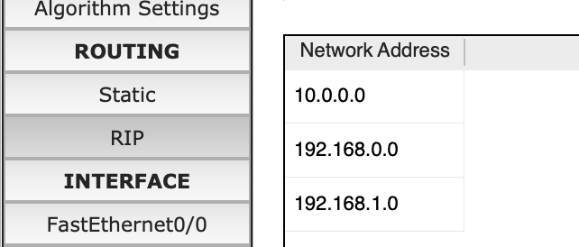
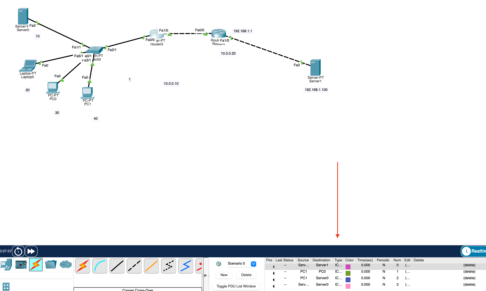
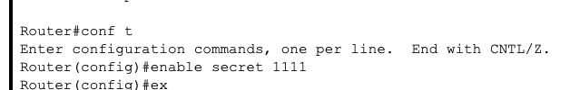

## Module 4 Networking Fundamentals
## TASK 4.3

Task:
Побудувати локальну мережу, що складається з сегмента на основікомутатора з 5 комп'ютерів і сервера. Комутатор з'єднаний з маршрутизатором, до якого також підключений сервер.Необхідно задати статичні IP адреси мережних інтерфейсів маршрутизаторів, локальних комп'ютерів і серверів. Налаштувати маршрутизацію по протоколу RIP.Домогтися можливості пересилання даних по протоколу ICMP між усіма об'єктами мережі.

