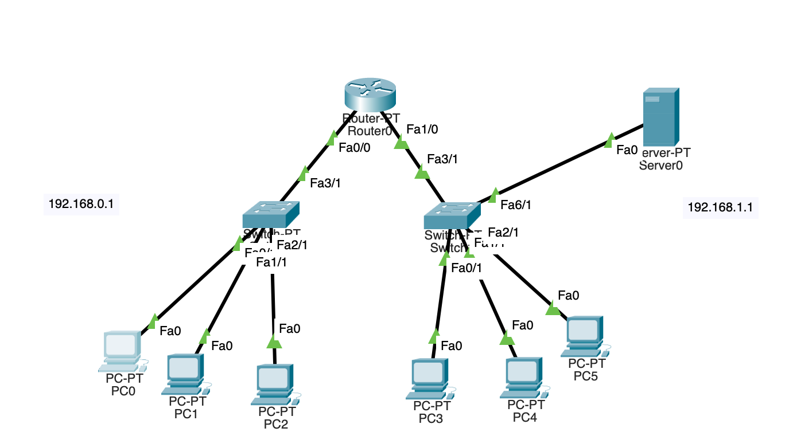
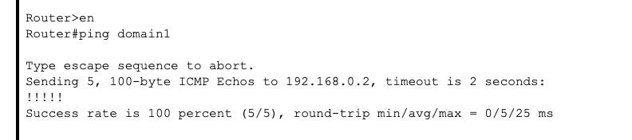
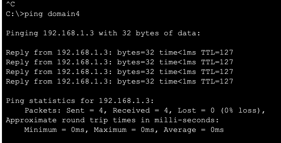
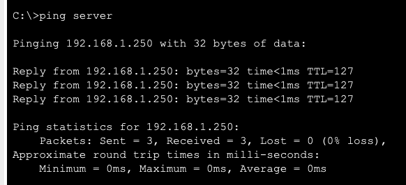
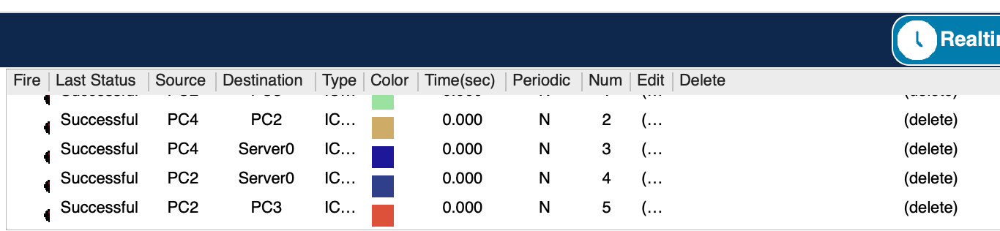
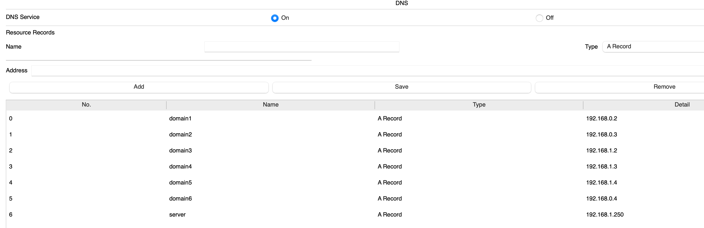

## Module 4 Networking Fundamentals
## TASK 4.4 bonus

## Task 1:

бонусне-не обов’язковедо виконання. За основу беремо будь яке завдання task4.2 або 4.3і у вашу існуючумережу додаєте роутер,такщоб їх в мережі було не менше двох. І треба налаштувати трафік між двома мережами.Якщо ж у вашій існуючій мережі вже присутньо 2 роутера і трафік налаштований, то виконання цього завдання не потрібно.

## Has been done in 3-d task

## Task 2:
Організувати 2 підмережі. Налаштувати DNS на серверах.

