# Task 5
## Linux essentials

Task1.Part1

1) Login into system as root
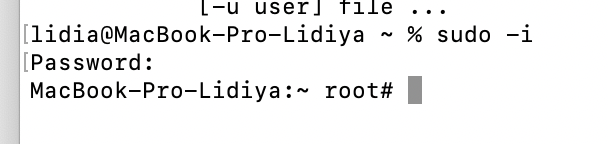

2) Use the passwd command to change the password. Examine the basic parameters of the command. What system file does it change *?

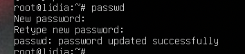

3)  Determine the users registered in the system, as well as what commands they execute. What additional information can be gleaned from the command execution?

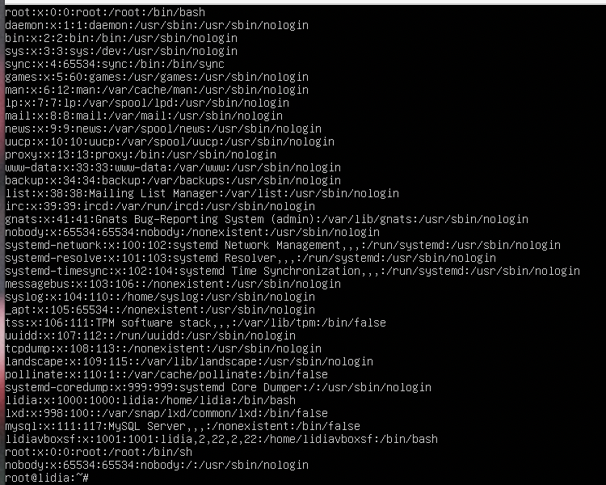

I used [getent passwd] or [less /etc/passwd]

Each line in the file has seven fields delimited by colons that contain the following information:

User name.
Encrypted password (x means that the password is stored in the /etc/shadow file).
1. User ID number (UID).
2. User’s group ID number (GID).
3. Full name of the user (GECOS).
4. User home directory.
5. Login shell (defaults to /bin/bash).

4) Change personal information about yourself.

Have changed to John Wick

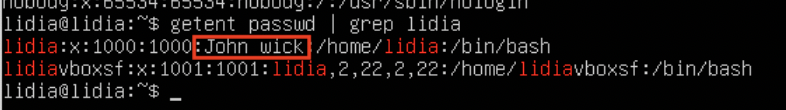

5) Become familiar with the Linux help system and the man and info commands. Get help on the previously discussed commands, define and describe any two keys for these commands. Give examples.

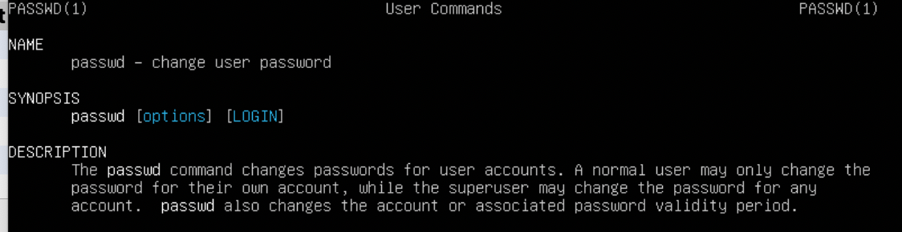

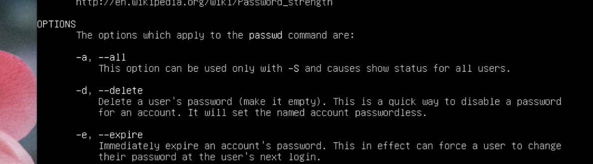

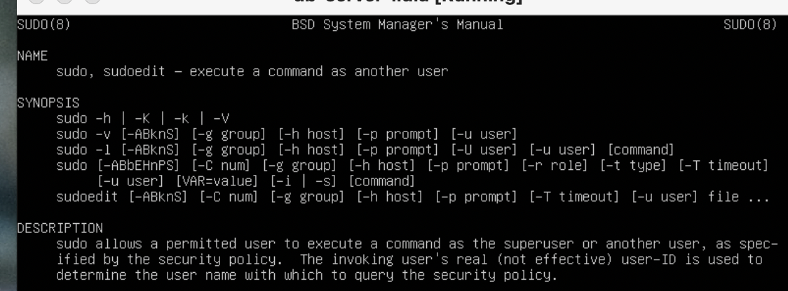

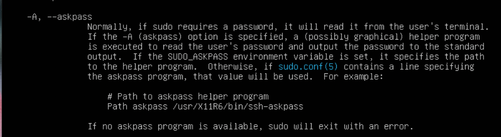

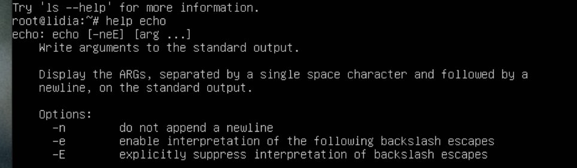

6) Explore the more and less commands using the help system. View the contents of files .bash* using commands.

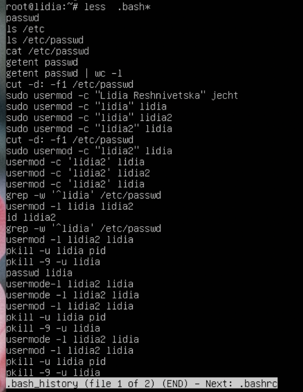

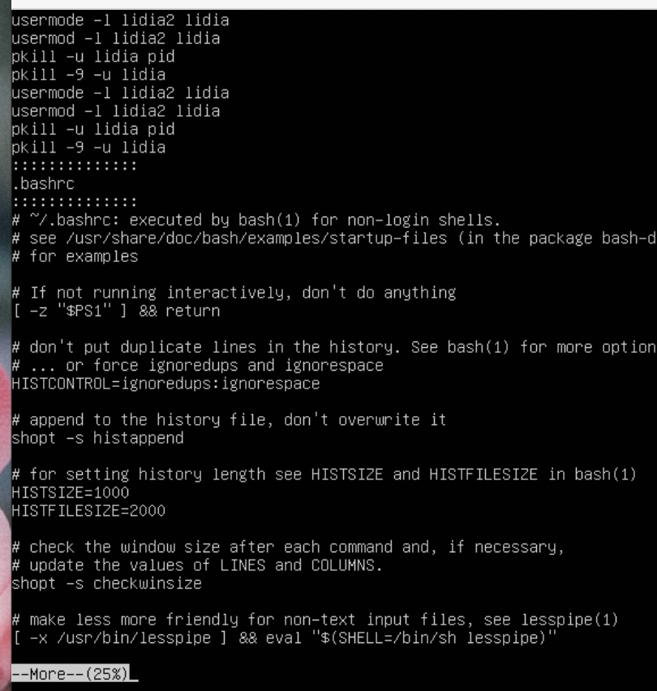

7) * Describe in plans that you are working on laboratory work 1. Tip: You should read the documentation for the finger command.

Solution: I have reminded myself such commands as: less/more because they are important as human readable mode

Via passwd we can change our credentials and via getent is a Linux command that helps the user to get the entries in a number of important text files.

Finger command is a user information lookup command which gives details of all the users logged in. This tool is generally used by system administrators. It provides details like login name, user name, idle time, login time, and in some cases their email address even. This tool is similar to the Pinky tool but the Pinky tool is just the lightweight version of this tool.

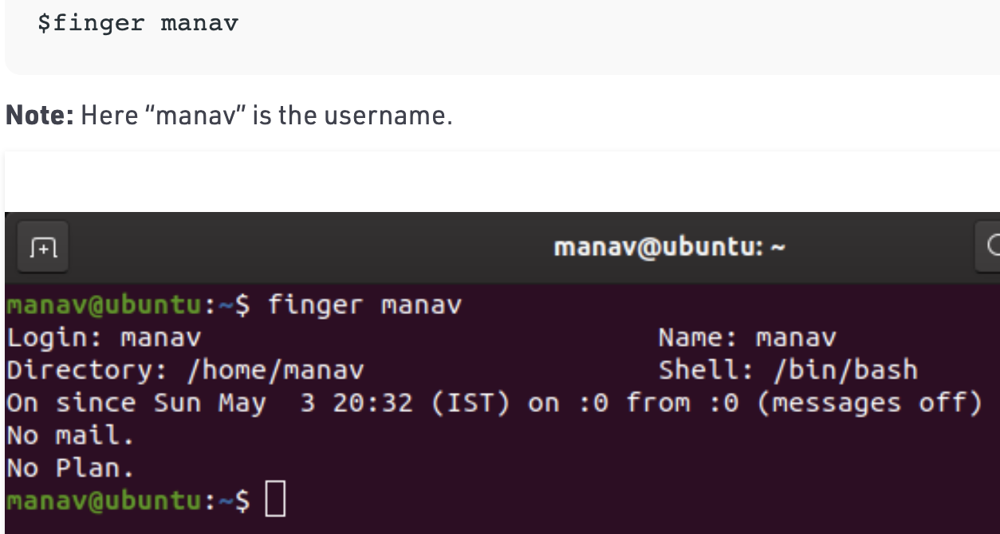

8) * List the contents of the home directory using the ls command, define its files and directories. Hint: Use the help system to familiarize yourself with the ls command.

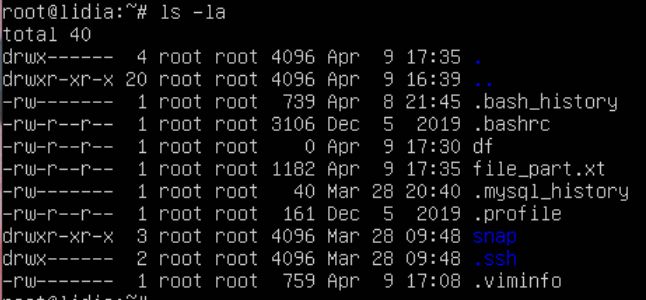

## Task1.Part2

1)Examine the tree command. Master the technique of applying a template, for example, display all files that contain a character c, or files that contain a specific sequence of characters. List subdirectories of the root directory up to and including the second nesting level.

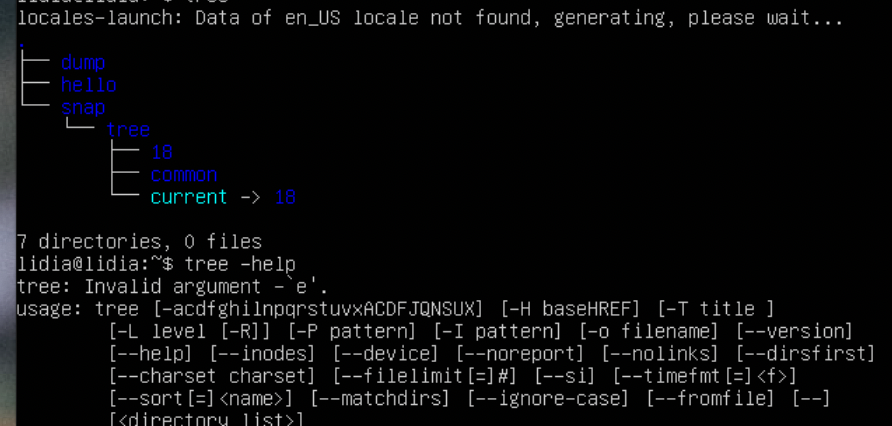

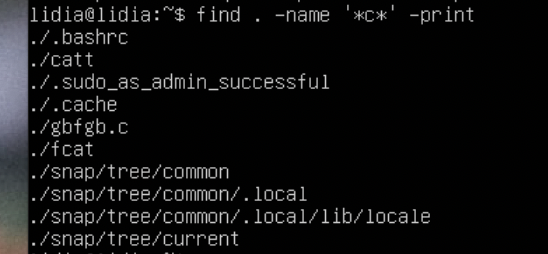

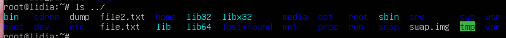

2)What command can be used to determine the type of file (for example, text or binary)? Give an example.

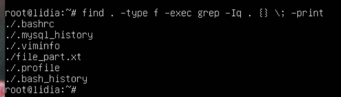

3) Master the skills of navigating the file system using relative and absolute paths. How can you go back to your home directory from anywhere in the filesystem?

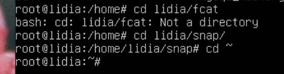

4)Become familiar with the various options for the ls    command. Give examples of listing directories using different keys. Explain the information displayed on the terminal using the -l and -a switches.

-l = use a long listing format

-a = do not ignore entries starting with ..

-t = show time

5)Perform the following sequence of operations: -  create a subdirectory in the home directory;-  in this subdirectory create a file containing information about directories located in the root directory (using I/O redirection operations);-  view the created file;-  copy the created file to your home directory using relative and absolute addressing.-  delete the previously created subdirectory with the file requesting removal;-  delete the file copied to the home directory

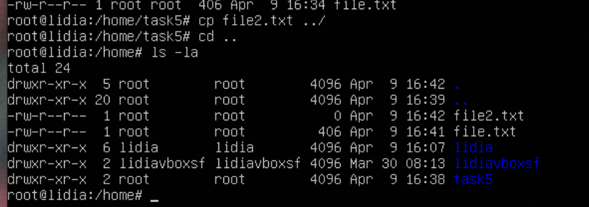

6) Perform the following sequence of operations:-  create a subdirectory testin the home directory;
-  copy the .bash_historyfile to this directory while changing its name to labwork2;-  create a hard and soft link to the labwork2file in the test subdirectory; -  how to define soft and hard link, what do theseconcepts;-  change the data by opening a symbolic link. What changes will happen and why -  rename the hard link file to hard_lnk_labwork2;-  rename the soft link file to symb_lnk_labwork2 file; -  then delete the labwork2. What changes have occurred and why?

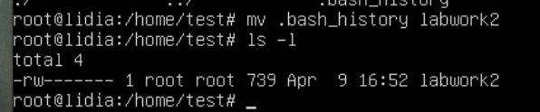

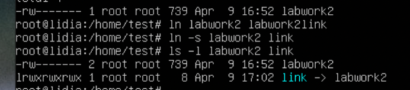

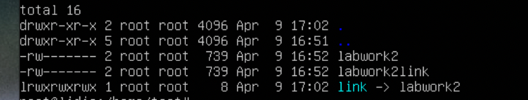

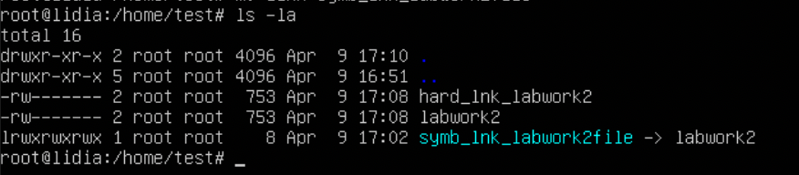

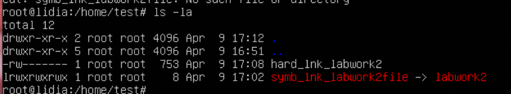

After deleting we lost data in the symb_link, but hard link left for us whole data.

7)Using the locate utility, find all files that contain the squid and traceroute sequence.

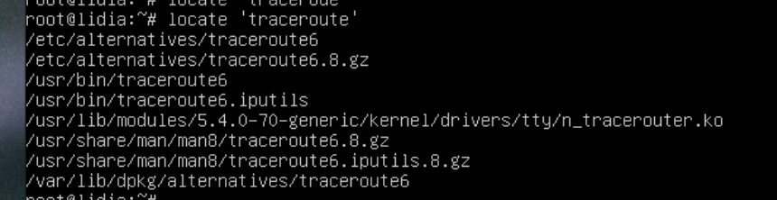

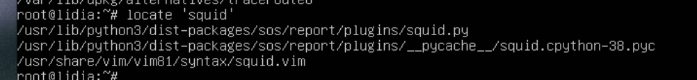

8) Determine which partitions are mounted in the system, as well as the types of these partitions.

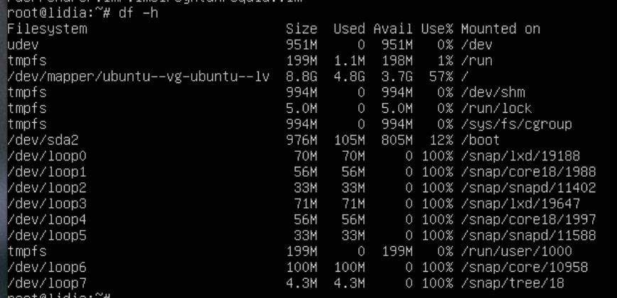

9) Count the number of lines containing a given sequence of characters in a given file.

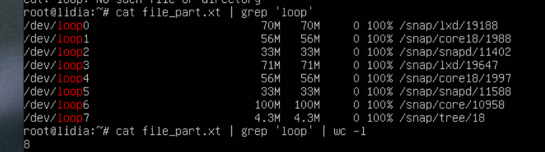

10) Using the find command, find all files in the /etc directory containing the host character sequence.

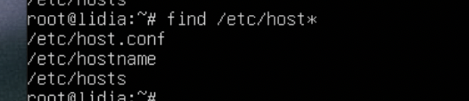

11) List all objects in /etc that contain the ss character sequence. How can I duplicate a similar command using a bunch of grep?

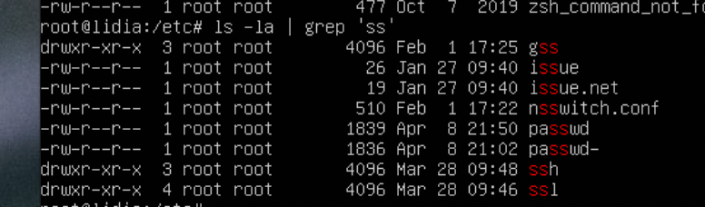

12) Organize a screen-by-screen print of the contents of the /etc directory. Hint: You must use stream redirection operations.

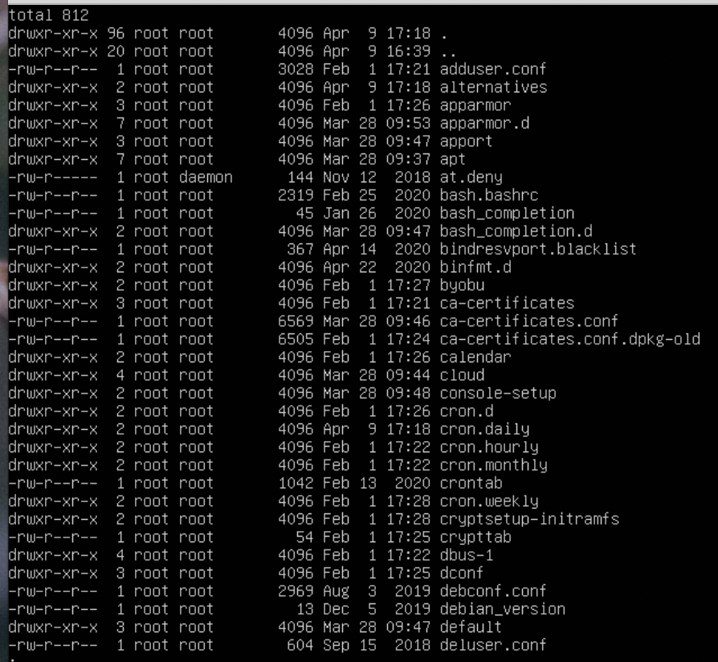

13) What are the types of devices and how to determine the type of device? Give examples.

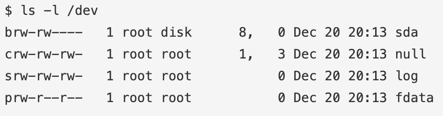

The columns are as follows from left to right:

1. Permissions
2. Owner
3. Group
4. Major Device Number
5. Minor Device Number
6. Timestamp
7. Device Name

Here are the most common device names that you will encounter:

SCSI Devices

If you have any sort of mass storage on your machine, chances are it is using the SCSI (pronounced "scuzzy") protocol. SCSI stands for Small Computer System Interface, it is a protocol used for allow communication between disks, printers, scanners and other peripherals to your system. You may have heard of SCSI devices which aren't actually in use in modern systems, however our Linux systems correspond SCSI disks with hard disk drives in /dev. They are represented by a prefix of sd (SCSI disk):

Common SCSI device files:

/dev/sda - First hard disk
/dev/sdb - Second hard disk
/dev/sda3 - Third partition on the first hard disk
Pseudo Devices

As we discussed earlier, pseudo devices aren't really physically connected to your system, most common pseudo devices are character devices:

/dev/zero - accepts and discards all input, produces a continuous stream of NULL (zero value) bytes
/dev/null - accepts and discards all input, produces no output
/dev/random - produces random numbers
PATA Devices

Sometimes in older systems you may see hard drives being referred to with an hd prefix:

/dev/hda - First hard disk
/dev/hdd2 - Second partition on 4th hard disk

14) How to determine the type of file in the system, what types of files are there?

We can use [find -type] command to determine files

15) * List the first 5 directory files that were recently accessed in the /etcdirectory.

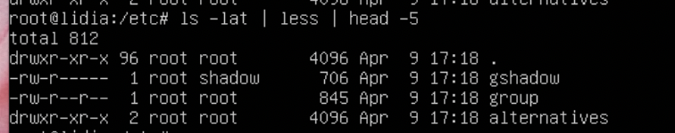
