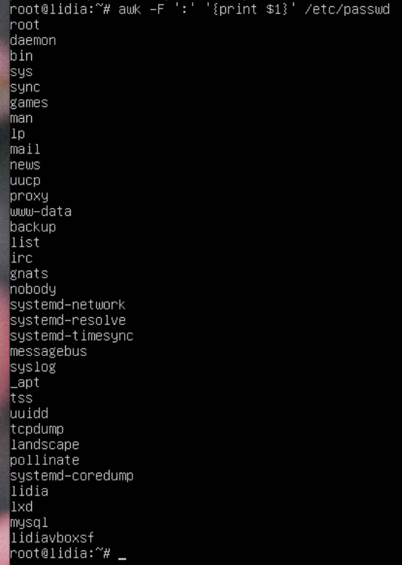
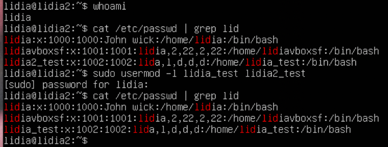
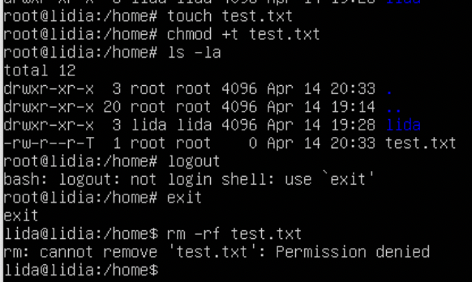

## Module 5 Linux
## TASK 5.2

1)Analyze the structure of the /etc/passwd and /etc/group file, what fields are present in it, what users exist on the system? Specify several pseudo-users, how to define them?

Local user information is stored in the /etc/passwd file.

It stores group information or defines the user groups i.e. it defines the groups to which users belong

The sudo command allows you to run programs with the security privileges of another user (by default, as the superuser). It prompts you for your personal password and confirms your request to execute a command by checking a file, called sudoers, which the system administrator configures. Using the sudoers file, system administrators can give certain users or groups access to some or all commands without those users having to know the root password. It also logs all commands and arguments so there is a record of who used it for what, and when.

Define users:

2) What are the uid ranges? What is UID? How to define it?

A UID (user identifier) is a number assigned by Linux to each user on the system. This number is used to identify the user to the system and to determine which system resources the user can access. UIDs are stored in the /etc/passwd file

The third field represents the UID. Notice how the root user has the UID of 0. Most Linux distributions reserve the first 100 UIDs for system use. New users are assigned UIDs starting from 500 or 1000. For example, new users in Ubuntu start from 1000

3) What is GID? How to define it?

Groups in Linux are defined by GIDs (group IDs). Just like with UIDs, the first 100 GIDs are usually reserved for system use. The GID of 0 corresponds to the root group and the GID of 100 usually represents the users group. GIDs are stored in the /etc/groups file:

4) How to determine belonging of user to the specific group?

5) What are the commands for adding a user to the system? What are the basic parameters required to create a user?

sudo adduser [lidia_test]

Gave for this user admin rights:

sudo usermod -aG sudo [lidia_test]

6) How do I change the name (account name) of an existing user?

7) What is skell_dir? What is its structure?

Directory /etc/skel/ (skel is derived from the “skeleton”) is used to initiate home directory when a user is first created. A sample layout of “skeleton” user files is as shown below:

8) How to remove a user from the system (including his mailbox)?

userdel userName
userdel [options] userName
userdel -r userName

9) What commands and keys should be used to lock and unlock a user account?

passwd -l user_name
passwd -u user_name

10) How to remove a user's password and provide him with a password-free login for subsequent password change?

I used cmd: sudo passwd -d lida

11) Display the extended format of information about the directory, tell about the information columns displayed on the terminal.

ls -la will chow us:

The file type.

The file permissions.

Number of hard links to the file.

File owner.

File group.

File size.

Date and Time.

File name.

12) What access rights exist and for whom (i. e., describe the main roles)? Briefly describe the acronym for access rights.

13) What is the sequence of defining the relationship between the file and the user?

14) What commands are used to change the owner of a file (directory), as well as the mode of access to the file? Give examples, demonstrate on the terminal.

15) What is an example of octal representation of access rights? Describe the umask command.

Permission values:
1 – able to execute (x)

2 – able to write (w)

4 – able to read (r)

6 (2+4) – able to write and read

600 is equivalent to rw-------

umask shows default mode:

16) Give definitions of sticky bits and mechanism of identifier substitution. Give an example of files and directories with these attributes.

"sticky bit." This permission does not affect individual files. However, at the directory level, it restricts file deletion. Only the owner (and root) of a file can remove the file within that directory. A common example of this is the /tmp directory:

17) What file attributes should be present in the command script?

In particular, some Linux-native filesystems support several attributes that you can adjust with the chattr command. The files and directories can have following attributes

a - append only

c - compressed

d - no dump

e - extent format

i - immutable

j - data journaling

s - secure deletion

t - no tail-merging

u - undeletable

A - no atime updates

D - synchronous directory updates

S - synchronous updates

T - top of directory hierarchy
