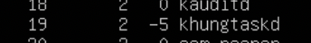
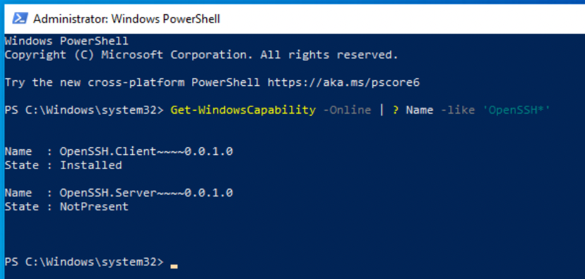

## Module 5 Linux
## TASK 5.3

1) How many states could has a process in Linux?

PROCESS STATE CODES

   R  running or runnable (on run queue)

   D  uninterruptible sleep (usually IO)

   S  interruptible sleep (waiting for an event to complete)

   Z  defunct/zombie, terminated but not reaped by its parent

   T  stopped, either by a job control signal or because
      it is being traced

2) Examine the pstree command. Make output (highlight) the chain (ancestors) of the current process.

It looks like pstree can do what you want, with it's -s Show parent processes of the specified process option

3) What is a proc file system?

Proc file system (procfs) is virtual file system created on fly when system boots and is dissolved at time of system shut down.

It contains the useful information about the processes that are currently running, it is regarded as control and information centre for kernel.

The proc file system also provides communication medium between kernel space and user space.

ls -l /proc

4)  Print information about the processor (its type, supported technologies, etc.).

5) Use the ps command to get information about the process. The information should be as follows: the owner of the process, the arguments with which the process was launched for execution, the group owner of this process, etc.

6) How to define kernel processes and user processes?

We can list all kernel threads like this via tuna:

and user process:

7) Print the list of processes to the terminal. Briefly describe the statuses of the processes. What condition are they in, or can they be arriving in?

we can use cmd: ps -aux

root - username

1 - PID (Linux process id)

19:10 - start time

/sbin/init.. - actual process

state S - interruptible sleep (waiting for an event to complete)

8) Display only the processes of a specific user.

We can use cmd : top -u [username] or ps -u [username]

9) What utilities can be used to analyze existing running tasks (by analyzing the help for the ps command)?

We can use top or lsof or ps -aux or htop

10)  What information does top command display?

Linux Top command is a performance monitoring program which is used frequently by many system administrators to monitor Linux performance and it is available under many Linux/Unix like operating systems. The top command used to dipslay all the running and active real-time processes in ordered list and updates it regularly. It display CPU usage, Memory usage, Swap Memory, Cache Size, Buffer Size, Process PID, User, Commands and much more. It also shows high memory and cpu utilization of a running processess. The top command is much userful for system administrator to monitor and take correct action when required. Let’s see top command in action.

11) We can use cmd : top -u [username]

12) What interactive commands can be used to control the top command? Give a couple of examples.

top c - will show absolute path of running process.

top d - refresh interval is N seconds, same can be change pressing ‘d‘ option in running top command and change it as desired as shown below.

13) Sort the contents of the processes window using various parameters (for example, the amount of processor time taken up, etc.)

14) Concept of priority, what commands are used to set priority?

There are a total of 140 priorities and two distinct priority ranges implemented in Linux. The first one is a nice value (niceness) which ranges from -20 (highest priority value) to 19 (lowest priority value) and the default is 0, this is what we will uncover in this guide. The other is the real-time priority, which ranges from 1 to 99 by default, then 100 to 139 are meant for user-space.

cmd: ps -eo pid,ppid,ni,comm

15) Can I change the priority of a process using the top command? If so, how?

16) Examine the kill command. How to send with the kill command process control signal? Give an example of commonly used signals.

17) Commands jobs, fg, bg, nohup. What are they for? Use the sleep, yes command to demonstrate the process control mechanism with fg, bg.

Кроме обычных PID, у задач в фоне имеется собственный номер, который всегда начинается с единицы (если нет других фоновых задач). Кроме того, jobs отображает состояние процесса — Running, Stopped, Done, Exit.

Например, по окончании архивирования — статус задачи станет Done:

Теперь, что бы продолжить её выполнение в фоновом режиме — введите команду bg (background):

1
bg

[8]+ tar cpf usr.lib.tar usr/lib 2> /dev/null &

Кроме обычных PID, у задач в фоне имеется собственный номер, который всегда начинается с единицы (если нет других фоновых задач). Кроме того, jobs отображает состояние процесса — Running, Stopped, Done, Exit.

Что бы вывести задачу из фонового режима — используется команда fg (foreground), которой можно либо передать номер задачи в качестве аргумента, либо — запустить без аргументов. В последнем случае — будет выведена задача, отмеченная знаком + в списке jobs, т.е. — последняя отправленная «в фон» задача.

nohup — утилита, которая позволяет запустить команду, защищенную от зависания с выходом на non-tty (игнорирует потерю сигналов связи SIGHUP).

## Part2

1. Check the implementability of the most frequently used OPENSSH commands in the MS Windows operating system. (Description of the expected result of the commands + screenshots: command – result should be presented)

ubuntu ip vm for test connection:

openssh configs:

succesfull connection:

2. Implement basic SSH settings to increase the security of the client-server connection

I have used authorized keys instead of passwords:

3. List the options for choosing keys for encryption in SSH. Implement 3 of them.

We can change the key type using the -t option. For example, if we want to create a Ed25519 key, we would simply use:

ssh-keygen -t ed25519
By default, these keys will be written to ~/.ssh/id_ed25519 and ~/.ssh/id_ed25519.pub, although we can change the filename to something else.

Similarly, we can explicitly state that we want a RSA key by using:

ssh-keygen -t rsa
If we want a different key size, we can specify it using the -b option. RSA keys can vary from 1024 to 16384 bits, and Ed25519 keys can vary from 256 to 16384 bits. As an example, if we want a 4096-bit RSA key, we should use:

ssh-keygen -b 4096

4. Implement port forwarding for the SSH client from the host machine to the guest Linux virtual machine behind NAT.

5*. Intercept (capture) traffic (tcpdump, wireshark) while authorizing the remote client on the server using ssh, telnet, rlogin. Analyze the result.

I used this command:

Saved capture of traffic:

