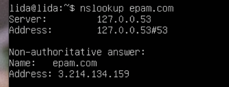

## Module 6 Networking with Linux
## TASK 6.1

1. Create virtual machines connection according to figure 1

2. VM2 has one interface (internal), VM1 has 2 interfaces (NAT and internal). Configure  all network interfaces in order to make VM2 has an access to the Internet (iptables, forward, masquerade).

nat and internal setup:

ssh connection from host:
  

ip a:

netplan configuration:

iptables for vm1:

internet connection for vm2:

route:

nslookup 8.8.8.8:

epam:

routing tables:

gateway default:

traceroute:

