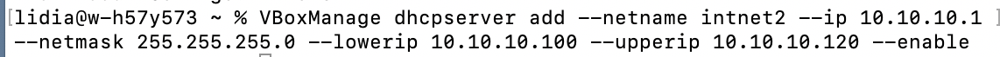
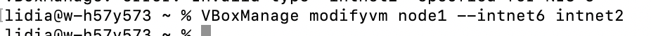
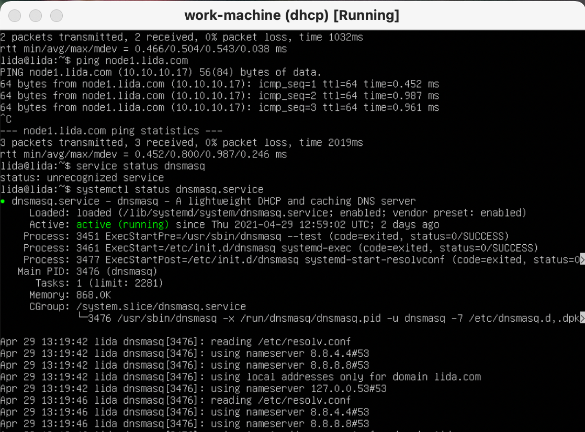
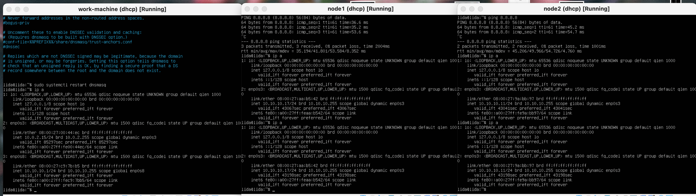
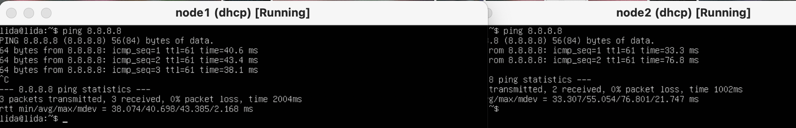
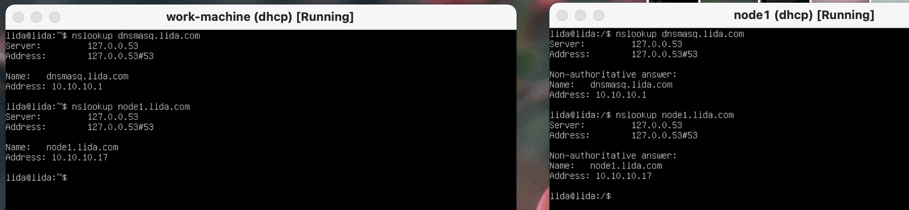
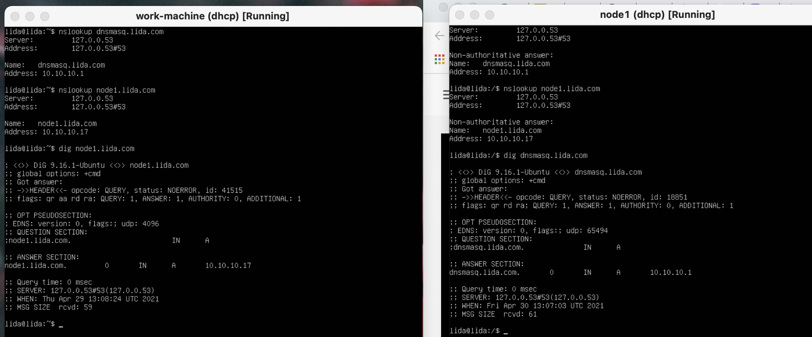
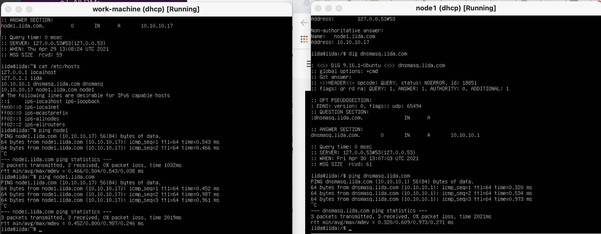

# Task 6.2
## Configuring  DHCP, DNS serversand dynamic routing using OSPF protocol

1. Use  already created internal-network for three VMs (VM1-  VM3)  .  VM1 has NAT and internal, VM2, VM3 – internal only interfaces.

2. Install and configure DHCP server on VM1. (3 ways: using VBoxManage, DNSMASQ and ISC-DHSPSERVER).

2.1. VBoxManage:

Adding dhcp server to intnet2 adapter

Modify adapter for node1:

it had assigned needed range for node1 with adapter intnet2

2.2 DNSMASQ:

assigned ip pool:

3.Check VM2 and VM3  for obtaining  network addresses from DHCP server.

4. Using existed network for three VMs ( from p.1) install and configure DNS server on VM1. (You can use DNSMASQ, BIND9 or something else).

5.Check VM2 and VM3  for gaining access to DNS server ( naming services).

