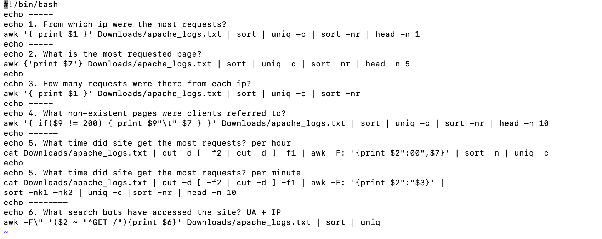

# Task 7.1
## Linux administration with bash. Home task

### B. Using Apache log example create a script to answer the following questions:

1. From which ip were the most requests?

2. What is the most requested page?

3. How many requests were there from each ip?

4. What non-existent pages were clients referred to?  

5. What time did site get the most requests?

6. What search bots have accessed the site? (UA + IP)

## Bash script:

## Result:

##C. Create a data backup script that takes the following data as parameters:

1. Path to the syncing  directory.

2. The path to the directory where the copies of the files will be stored.In case of adding new or deleting old files, the script must add a corresponding entry to the log file indicating the time, type of operation and file name. [The command to run the script must be added to crontab with a run frequency of one minute]

## Script:

## Logfile:

## backup

2021
