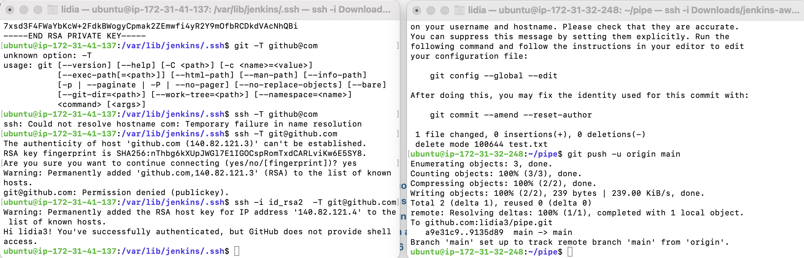

# Task 8.1
## Continuous integration / Continuous delivery

### 1. Jenkins set up on AWS:

### 2. Jenkins job:

### 3. apache web server after Jenkins build:

### 4. git connection:

### 5. build trigger:

### 6. Job configuration:

### 7. Succeed jobs:

### 8. Servers of jenkins and apache:

### Webhook:

### Code in git:

### Keys:

### Slave creation:

### Creating job for slave:

### Result:

### On web-server res:

### Job configuration:

### Jenkins CLI:

### Pipeline creation via script:

### Maven result:

### All jobs:

